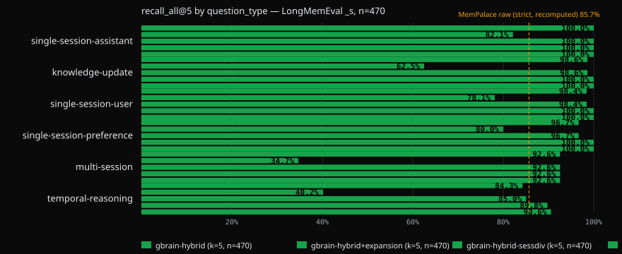

# BrainBench: LongMemEval (public benchmark)

> ## UPDATE (2026-09-02) — re-run at gbrain v0.48.2.0
>
> A fresh single run of this benchmark at the current gbrain release, five
> arms, scored under the official metric from the start. Two numbers lead,
> both labelled. **Reranker off, gbrain-hybrid scores 93.19% official
> `recall_all@5` (438/470)**: this is the like-for-like row against the May
> 2026 receipt and master's v0.48.0.0 receipt (gbrain PR #4787: 93.19%,
> identical per-type numbers), reproduced digit for digit. **With the
> release default reranker `voyage:rerank-2.5` on, gbrain-hybrid+rerank
> scores 95.32% (448/470)**: this is the release default path, because the
> `balanced` and `tokenmax` search modes run the reranker. Dataset
> `longmemeval_s` (the cleaned Sept-2025 revision of the S split: 500
> questions, the 30 abstention questions excluded from recall denominators
> per the official protocol, 470 scored), k=5, measured 2026-09-02 at
> gbrain v0.48.2.0. v0.48.2.0 changes the reranker default to
> `voyage:rerank-2.5`; with the reranker off, retrieval is unchanged from
> v0.48.0.0.
>
> **What this run pins.** gbrain v0.48.2.0 (merged SHA `172df271`, branch
> `yaounde`, gbrain PR #4792); the gbrain-evals runner at main `29e9ac9` with
> the local clone's gbrain pin bumped to that SHA; dataset `longmemeval_s`,
> cleaned Sept-2025 revision (HF `xiaowu0162/longmemeval-cleaned`), 500
> questions, n=470 scored; k=5; search mode `balanced` pinned, autocut OFF,
> reranker OFF on the three reranker-off arms and `voyage:rerank-2.5` ON on
> the two rerank arms; embedder `openai:text-embedding-3-large@1536`; single
> run in fixed dataset order; 0 error rows in every arm.
>
> All five arms, `longmemeval_s` cleaned Sept-2025 revision, n=470 scored, k=5,
> 2026-09-02, gbrain v0.48.2.0. Paired flips count questions whose
> `recall_all@5` went 0 to 1 (gained) or 1 to 0 (lost) against the
> reranker-off gbrain-hybrid row on the same question ids. Latency is per
> question (p50 / p99) and wall is the whole 500-question arm, from the
> aggregator receipts:
>
> | Adapter | official `recall_all@5` | any-hit `recall_any@5` (diagnostic) | nDCG_any@5 | distinct sessions in top-5 (mean) | paired vs gbrain-hybrid (gained / lost) | p50 / p99 per question, wall | Status |
> |---|---|---|---|---|---|---|---|
> | **gbrain-hybrid** (reranker off; the like-for-like row vs May 2026 and v0.48.0.0) | **93.19%** (438/470) | 98.72% | 93.32% | 4.90 (5 sessions on 422 questions, 4 on 47, 3 on 1) | reference | 3,707 ms / 6,348 ms, 1,977 s | complete, 0 errors |
> | gbrain-hybrid+expansion (tokenmax's LLM multi-query expansion, reranker off) | 54.89% (258/470) | 86.60% | 71.68% | 5.00 | +3 / -183 | 5,079 ms / 8,014 ms, 2,677 s | complete, 0 errors; harmful at k=5 (v0.48.0.0 receipt: 49.6%) |
> | gbrain-hybrid-sessdiv (3x over-fetch, top-5 distinct sessions, reranker off) | 93.40% (439/470) | 98.72% | 93.38% | 5.00 | +1 / -0 | 3,701 ms / 6,371 ms, 1,987 s | complete, 0 errors; first measurement |
> | **gbrain-hybrid+rerank** (`voyage:rerank-2.5` ON; the release default path) | **95.32%** (448/470) | 99.79% | 95.77% | 4.89 | +18 / -8 | 3,821 ms / 6,298 ms, 2,029 s | complete, 0 errors; first reranker-on measurement |
> | gbrain-hybrid-sessdiv+rerank (`voyage:rerank-2.5` ON; release default path plus over-fetch) | 95.53% (449/470) | 99.79% | 95.82% | 5.00 | +19 / -8 | 3,795 ms / 6,317 ms, 2,031 s | complete, 0 errors; first reranker-on measurement |
>
> Every row is derived from its own committed NDJSON plus aggregator receipt
> (listed under Receipts). Reading the five arms:
>
> - **Release default path.** The two reranker-on arms run `voyage:rerank-2.5`,
>   the v0.48.2.0 default; the `balanced` and `tokenmax` search modes run the
>   reranker, so 95.32% (gbrain-hybrid+rerank, 448/470) is the number a
>   default install produces at k=5. Against the reranker-off hybrid row the
>   reranker flips 18 questions right and 8 wrong, net +10, for +114 ms at
>   p50 (3,707 to 3,821 ms) and one Voyage rerank call per query, no
>   generative model in the loop.
> - **Like-for-like row.** gbrain-hybrid with the reranker off is the row that
>   compares against the May 2026 v0.28.8 receipt (83.40%) and the v0.48.0.0
>   receipt (93.19%); it reproduces v0.48.0.0 digit for digit, per type.
> - **Expansion is harmful at k=5.** tokenmax's LLM multi-query expansion
>   scores 54.89% strict (258/470) and 86.60% any-hit; against plain hybrid it
>   loses 183 questions and gains 3, and p50 latency rises from 3,707 ms to
>   5,079 ms. The v0.48.0.0 receipt measured the same arm at 49.6%. The
>   `tokenmax` mode turns expansion on; do not pair it with a small k.
> - **Session-diversity over-fetch adds one question.** hybrid-sessdiv gains 1
>   and loses 0 against hybrid (439 vs 438 of 470); sessdiv+rerank gains 1
>   over rerank alone (449 vs 448). Filling all five slots with distinct
>   sessions (mean 5.00 vs 4.90) is not where the misses are: slot starvation
>   is not the miss class. The remaining misses are gold sessions ranked
>   outside the top five, which is why the reranker moves the number and the
>   over-fetch does not.
>
> 
>
> Per question type, `recall_all@5`, all five arms (the May column is the
> 2026-08-31 resolution below, same metric, same n; May ran gbrain-hybrid
> with no reranker):
>
> | question_type | n | gbrain-hybrid (reranker off) | gbrain-hybrid+expansion | gbrain-hybrid-sessdiv | gbrain-hybrid+rerank (release default) | gbrain-hybrid-sessdiv+rerank | May 2026, v0.28.8 |
> |---|---|---|---|---|---|---|---|
> | knowledge-update | 72 | 98.6% (71/72) | 62.5% (45/72) | 98.6% (71/72) | 100.0% (72/72) | 100.0% (72/72) | 98.6% |
> | multi-session | 121 | 92.6% (112/121) | 34.7% (42/121) | 92.6% (112/121) | 92.6% (112/121) | 92.6% (112/121) | 71.9% |
> | single-session-assistant | 56 | 100.0% (56/56) | 82.1% (46/56) | 100.0% (56/56) | 100.0% (56/56) | 100.0% (56/56) | 100.0% |
> | single-session-preference | 30 | 96.7% (29/30) | 80.0% (24/30) | 96.7% (29/30) | 100.0% (30/30) | 100.0% (30/30) | 93.3% |
> | single-session-user | 64 | 98.4% (63/64) | 78.1% (50/64) | 98.4% (63/64) | 100.0% (64/64) | 100.0% (64/64) | 96.9% |
> | temporal-reasoning | 127 | 84.3% (107/127) | 40.2% (51/127) | 85.0% (108/127) | 89.8% (114/127) | 90.6% (115/127) | 69.3% |
> | **all types** | **470** | **93.19% (438/470)** | **54.89% (258/470)** | **93.40% (439/470)** | **95.32% (448/470)** | **95.53% (449/470)** | **83.40%** |
>
> 
>
> Temporal-reasoning is still the weakest type and the next target: 84.3%
> with the reranker off, 89.8% on the release default path. The reranker's
> net +10 lands as +7 on temporal-reasoning (107 to 114 of 127) and +1 each
> on knowledge-update, single-session-preference and single-session-user,
> which all reach 100%. Multi-session stays at 92.6% (112/121) in every arm
> except expansion, so the nine multi-session misses are not something the
> reranker or the over-fetch reaches at k=5. The ceiling at k=5 on this
> dataset is 99.4% (467/470): 3 questions carry 6 gold sessions and cannot
> fit in a top-5 list. Pure vector on the same corpus scored 93.8% on the
> v0.48.0.0 receipt, so the hybrid layer is roughly neutral on this
> benchmark and earns its keep elsewhere.
>
> **The regression story, kept public.**
>
> - May 2026, v0.28.8: 83.40% `recall_all@5` (392/470). The report below led
>   with 97.66% any-hit, which is now a diagnostic only.
> - Between v0.28.8 and v0.48.0.0, an unpublished regression in how hybrid
>   search fused keyword-fallback rows with vector results dragged hybrid to
>   51.3%. Re-measured this session at the previous evals pin `2a56b512`
>   (gbrain v0.47.8.0): **51.39%** (241/469; one question returned an
>   infrastructure error and the aggregator excludes it from the
>   denominator). Committed as the pre-fix bracket below.
> - v0.48.0.0 (2026-09-01, gbrain PR #4787): the fix, 93.19%.
> - v0.48.2.0 (2026-09-02, this run): 93.19% with the reranker off,
>   identical per type; 95.32% with the default `voyage:rerank-2.5` on.
>
> **What moved mechanically.** The gain from 51.39% to 93.19% comes from one
> change in the fusion step of hybrid search, shipped in v0.48.0.0, not from
> any ranker change in v0.48.2.0. Hybrid search runs a keyword arm and a
> vector arm and fuses them with Reciprocal Rank Fusion. When a query's exact
> words did not co-occur in any one chunk, the keyword arm fell back from AND
> to OR matching and returned loose word matches; those fallback rows carried
> full fusion votes and outvoted the semantically right sessions coming from
> the vector arm. v0.48.0.0 mutes the fallback rows when the vector arm is
> healthy (search meta reports the muted count as `relaxed_dropped`); the
> fallback keeps its rescue role for keyless installs and provider outages.
> Multi-session and temporal questions, which need several sessions inside
> the top 5, recovered the most, which is what the per-type table shows.
> With the reranker off, the v0.48.2.0 reranker succession leaves this path
> untouched, and the identical receipt is the evidence.
>
> **Cross-system reading.** The strict-vs-any-hit and retrieval-vs-answer-
> accuracy distinctions that decide whether any two LongMemEval numbers can
> sit side by side live in
> [`docs/comparison-systems.md`](../comparison-systems.md). On the strict
> metric on this dataset we found no published score above 93.19% (the
> reranker-off row; the release default path scores 95.32%), with
> stated caveats: the field is thin, and the two closest strict comparisons
> are our own recomputations of MemPalace's committed per-question rankings
> (85.7% raw, 88.7% on its tuned held-out subset, 90.0% with an LLM
> reranking the top 20, the row that sits beside gbrain's 95.32%
> reranker-on arm); ContextFit's self-reported 87.45% All@5 is loosely
> comparable (its rerank layer reads gold labels). MemPalace's published
> 96.6% / 98.4% and ContextFit's 98.94% are any-hit figures that sit next to
> gbrain's 98.72% any-hit, not next to 93.19%.
>
> **Receipts (committed in this directory).**
>
> - [`rerun-2026-09-02-v0.48.2.0-hybrid.ndjson`](2026-05-07-longmemeval-s/rerun-2026-09-02-v0.48.2.0-hybrid.ndjson):
>   500 per-question rows, one per question, 30 abstention rows included
>   (sha256 `0f9eef7bd1c9cb2d37a32eb40398bc9b8e8058e0d07adc01c789a590b014208d`,
>   239,969 bytes).
> - [`rerun-2026-09-02-v0.48.2.0-hybrid.json`](2026-05-07-longmemeval-s/rerun-2026-09-02-v0.48.2.0-hybrid.json):
>   the aggregator receipt for those rows, recording `gbrain_version`
>   0.48.2.0 and the pin
>   (sha256 `33ebd15c66527c065634f67b2a88b4c90cda8abd39b45c7e4edec871eb849e54`,
>   2,693 bytes).
> - [`prefix-bracket-2a56b512-v0.47.8.0.ndjson`](2026-05-07-longmemeval-s/prefix-bracket-2a56b512-v0.47.8.0.ndjson):
>   the pre-fix bracket at the old pin: 500 gbrain-hybrid rows, 500
>   gbrain-hybrid+expansion rows, and 8 gbrain-hybrid-sessdiv rows from an
>   incomplete pass (not scored). Only the hybrid arm (51.39%) is quoted
>   above
>   (sha256 `7eea95862e455928bbc9f1c14705b2f9bcd3a26285605bb7ed75ddf076b6dc7f`,
>   461,647 bytes).
> - [`rerun-2026-09-02-v0.48.2.0-hybrid+expansion.ndjson`](2026-05-07-longmemeval-s/rerun-2026-09-02-v0.48.2.0-hybrid+expansion.ndjson):
>   500 per-question rows for the expansion arm, 30 abstention rows
>   included, 0 error rows
>   (sha256 `c9194e9848d6d0498a32bd8babc51c78c2c0818211648ca107069e236a624f0a`,
>   247,380 bytes), and its aggregator receipt
>   [`rerun-2026-09-02-v0.48.2.0-hybrid+expansion.json`](2026-05-07-longmemeval-s/rerun-2026-09-02-v0.48.2.0-hybrid+expansion.json)
>   (sha256 `489079b2aa962263157d7476c2a2c14402789c65d8d11d46e1e32c9de1f59184`,
>   2,547 bytes).
> - [`rerun-2026-09-02-v0.48.2.0-hybrid-sessdiv.ndjson`](2026-05-07-longmemeval-s/rerun-2026-09-02-v0.48.2.0-hybrid-sessdiv.ndjson):
>   500 rows for the session-diversity arm, 0 error rows
>   (sha256 `ba62721d6741bea52d0fa9be7d893e7c0133d4e82a7d182b816711f36abd42ab`,
>   282,753 bytes), and its aggregator receipt
>   [`rerun-2026-09-02-v0.48.2.0-hybrid-sessdiv.json`](2026-05-07-longmemeval-s/rerun-2026-09-02-v0.48.2.0-hybrid-sessdiv.json)
>   (sha256 `80d6bc7da40fb185ac83cf5d456bbf0618c4125d2c779db42ce585a2bd1813a9`,
>   2,518 bytes).
> - [`rerun-2026-09-02-v0.48.2.0-hybrid+rerank.ndjson`](2026-05-07-longmemeval-s/rerun-2026-09-02-v0.48.2.0-hybrid+rerank.ndjson):
>   500 rows for the release default path (`voyage:rerank-2.5` on), 0 error
>   rows
>   (sha256 `3b2f7a60d6550a5650d5ad18310203376218811371b58f8771b3ce3526e7e7a7`,
>   243,725 bytes), and its aggregator receipt
>   [`rerun-2026-09-02-v0.48.2.0-hybrid+rerank.json`](2026-05-07-longmemeval-s/rerun-2026-09-02-v0.48.2.0-hybrid+rerank.json)
>   (sha256 `7a2220b65bd1b642462e150d8b68f35350a5c564fc2bac992de7f18452ad0507`,
>   2,644 bytes).
> - [`rerun-2026-09-02-v0.48.2.0-hybrid-sessdiv+rerank.ndjson`](2026-05-07-longmemeval-s/rerun-2026-09-02-v0.48.2.0-hybrid-sessdiv+rerank.ndjson):
>   500 rows for the reranked session-diversity arm, 0 error rows
>   (sha256 `2d0b9d132a0fc53099a48144ef44c94a073cad7c9897e66113f7210990eb7155`,
>   286,623 bytes), and its aggregator receipt
>   [`rerun-2026-09-02-v0.48.2.0-hybrid-sessdiv+rerank.json`](2026-05-07-longmemeval-s/rerun-2026-09-02-v0.48.2.0-hybrid-sessdiv+rerank.json)
>   (sha256 `cd70679a80445bc2da74f51e7ea0a984c6410816ec625ba4f22b26b170303a4a`,
>   2,479 bytes).
> - [`rerun-2026-09-02-v0.48.2.0-all-arms.json`](2026-05-07-longmemeval-s/rerun-2026-09-02-v0.48.2.0-all-arms.json):
>   the five arms aggregated in one receipt, summaries in table order, the
>   input to the two charts
>   (sha256 `32d543aa37a2028cb2b5943d673e2c1e57603e2d9dd4d5f17b7db63caba8e473`,
>   11,703 bytes).
> - [`rerun-2026-09-02-v0.48.2.0.headline.svg`](2026-05-07-longmemeval-s/rerun-2026-09-02-v0.48.2.0.headline.svg)
>   (sha256 `9e685061f3f5a5fda1c81c052eb2773ab8b549fc3b366401e58eafb102c2eccd`,
>   6,267 bytes) and
>   [`rerun-2026-09-02-v0.48.2.0.per-type.svg`](2026-05-07-longmemeval-s/rerun-2026-09-02-v0.48.2.0.per-type.svg)
>   (sha256 `ce84fcf11f692e4995c228ba876a950f96aa50f3bc3d7402dbdd2a20c25591a6`,
>   11,823 bytes): the two charts inlined above, regenerated 2026-09-02 from
>   the all-arms receipt.
> - Manifest entries: `longmemeval-rerun-v0.48.2.0-hybrid`,
>   `longmemeval-rerun-v0.48.2.0-hybrid-rows`,
>   `longmemeval-rerun-v0.48.2.0-hybrid+expansion` (+ `-rows`),
>   `longmemeval-rerun-v0.48.2.0-hybrid-sessdiv` (+ `-rows`),
>   `longmemeval-rerun-v0.48.2.0-hybrid+rerank` (+ `-rows`),
>   `longmemeval-rerun-v0.48.2.0-hybrid-sessdiv+rerank` (+ `-rows`),
>   `longmemeval-rerun-v0.48.2.0-all-arms`,
>   `longmemeval-rerun-v0.48.2.0-chart-headline`,
>   `longmemeval-rerun-v0.48.2.0-chart-per-type`, and
>   `longmemeval-prefix-bracket-v0.47.8.0` in
>   [`docs/receipts-manifest.json`](../receipts-manifest.json).
>
> Re-derive every number in the tables above keyless, without the dataset
> (one aggregator call per arm):
>
> ```sh
> bun eval/runner/longmemeval-aggregate.ts docs/benchmarks/2026-05-07-longmemeval-s/rerun-2026-09-02-v0.48.2.0-hybrid.ndjson --top-k 5 --dataset s --output /tmp/rederive-v0.48.2.0-hybrid
> bun eval/runner/longmemeval-aggregate.ts docs/benchmarks/2026-05-07-longmemeval-s/rerun-2026-09-02-v0.48.2.0-hybrid+expansion.ndjson --top-k 5 --dataset s --output /tmp/rederive-v0.48.2.0-hybrid+expansion
> bun eval/runner/longmemeval-aggregate.ts docs/benchmarks/2026-05-07-longmemeval-s/rerun-2026-09-02-v0.48.2.0-hybrid-sessdiv.ndjson --top-k 5 --dataset s --output /tmp/rederive-v0.48.2.0-hybrid-sessdiv
> bun eval/runner/longmemeval-aggregate.ts docs/benchmarks/2026-05-07-longmemeval-s/rerun-2026-09-02-v0.48.2.0-hybrid+rerank.ndjson --top-k 5 --dataset s --output /tmp/rederive-v0.48.2.0-hybrid+rerank
> bun eval/runner/longmemeval-aggregate.ts docs/benchmarks/2026-05-07-longmemeval-s/rerun-2026-09-02-v0.48.2.0-hybrid-sessdiv+rerank.ndjson --top-k 5 --dataset s --output /tmp/rederive-v0.48.2.0-hybrid-sessdiv+rerank
> bun eval/runner/longmemeval-aggregate.ts docs/benchmarks/2026-05-07-longmemeval-s/prefix-bracket-2a56b512-v0.47.8.0.ndjson --top-k 5 --dataset s --output /tmp/rederive-prefix
> ```
>
> Reproduce the run itself (keys required; the runner pins mode `balanced`
> with reranker and autocut off for every adapter, and pins
> `voyage:rerank-2.5` on for the `rerank` specs; without `--adapters` it runs
> the four legacy adapters, not the five arms tabled above):
>
> ```sh
> bash eval/runner/longmemeval-batch.sh \
>   --adapters hybrid,hybrid+expansion,hybrid-sessdiv,hybrid+rerank,hybrid-sessdiv+rerank \
>   --embedding-model openai:text-embedding-3-large --embedding-dims 1536
> ```
>

> ## ERRATUM (2026-08-31) — metric definition
>
> **The recall numbers in this report are ANY-HIT recall@5, not the official
> LongMemEval `recall_all@5`.** Our runner counted a question as recalled if
> ANY of its ground-truth sessions appeared in the top-5. The official
> evaluator ([`src/retrieval/eval_utils.py`](https://github.com/xiaowu0162/LongMemEval))
> requires ALL ground-truth sessions in the top-k
> (`all(doc in recalled_docs for doc in correct_docs)`), which is the metric
> published systems report against. For single-session questions the two are
> identical; for the 133 multi-session questions (and part of
> temporal-reasoning) any-hit is strictly looser — the multi-session rows
> showing 100.0% below are the most inflated, and the head-to-head table's
> "same metric" claim does not hold for those rows.
>
> The runner now computes `recall_all@5` as the headline metric (any-hit is
> reported separately as a diagnostic).
>
> ## ERRATUM RESOLVED (2026-08-31) — the corrected numbers
>
> The original May run's per-question NDJSON stream survived, so the official
> metric was recomputed from the raw rows at **$0** with the audited
> aggregator (`longmemeval-aggregate.ts` recomputes every metric from
> `retrieved` + `ground_truth`; committed artifacts:
> [`rescore-may-2026-08-31.json`](2026-05-07-longmemeval-s/rescore-may-2026-08-31.json) /
> [`.md`](2026-05-07-longmemeval-s/rescore-may-2026-08-31.md)). **These are
> the same retrieval results the 97.60% claim was measured on — only the
> scoring is corrected.**
>
> | Adapter | official `recall_all@5` | any-hit `recall_any@5` (diagnostic) | nDCG_any@5 |
> |---|---|---|---|
> | **gbrain-hybrid** | **83.40%** | 97.66% | 90.58% |
> | gbrain-hybrid+expansion | **84.26%** | 97.66% | 90.83% |
> | gbrain-vector | 79.36% | 97.45% | 88.67% |
> | gbrain-keyword | 10.64% | 20.43% | 16.22% |
>
> Per question type (`recall_all@5`, hybrid): knowledge-update 98.6%,
> single-session-assistant 100%, single-session-user 96.9%,
> single-session-preference 93.3%, **multi-session 71.9%**,
> **temporal-reasoning 69.3%** — the reductions landed largely where the
> erratum predicted (multi-session and temporal-reasoning), with one
> correction to the original erratum's scoping: knowledge-update questions
> also carry multi-session ground truth, so that row dips too (98.6% vs the
> historical 100.0% — one question).
>
> Validation receipts (all in the committed artifacts + wave PR):
> - **Reconciliation is exact.** Under the old any-hit-over-500 semantics the
>   rescored rows reproduce the published number to the digit: 459 non-`_abs`
>   any-hits + 29 of 30 `_abs` any-hits = 488/500 = **97.60%**.
> - **Ground truth validated**: every row's `ground_truth` matches the
>   canonical dataset's `answer_session_ids` exactly (500/500, 0 mismatches).
>   The validator now lives in-repo at
>   `eval/runner/longmemeval-validate-ndjson.ts`; re-running the full
>   500/500 ground-truth check requires the gated HuggingFace dataset
>   downloaded locally.
> - **Denominator change (disclosed)**: the corrected protocol excludes the
>   30 `_abs` abstention questions from recall denominators (n=470; they
>   score as `abs_noise@5` = 33.3%). Zero error rows; 696 duplicate
>   worker-resume rows deduped (non-error preferred).
> - **Retrieved-list caveat**: the adapter retrieves top-5 CHUNKS then
>   dedupes to sessions, so a row can hold fewer than 5 distinct sessions —
>   the corrected number is therefore a LOWER bound on top-5-SESSION
>   retrieval. This is unchanged from the original run (old and new rows
>   stay comparable); a separately-disclosed session-diversity row is
>   pre-registered in the 2026-08 fix wave.
> - **Comparability warning**: competitor rows (MemPal raw 96.6%, held-out
>   reranked 98.4%) are labeled "R@5" with the variant UNSTATED — do not
>   read 83.40% vs 96.6% as same-metric without that caveat. Under any-hit,
>   gbrain's 97.66% (n=470) / 97.60% (n=500, old protocol) stands as
>   published.
> - **Expansion is no longer a null result** under the official metric:
>   +0.85pp overall (4 of 470 questions) and +3.9pp on temporal-reasoning (73.2% vs 69.3%) — the
>   §1 "clean null result" claim below was an artifact of the saturated
>   any-hit metric.
>
> Correct re-run commands (the previously documented command was broken —
> `--dataset` takes a split NAME, the file goes in `--path`, and the runner's
> default k is 8):
>
> ```sh
> bun eval/runner/longmemeval.ts --path ~/datasets/longmemeval/longmemeval_s.json --top-k 5
> # or, the published multi-worker shape (defaults: k=5, dataset s, resume):
> bash eval/runner/longmemeval-batch.sh
> ```
>
> ## ADDENDUM (2026-09-01) — raw rows committed, resolution re-derivable
>
> The per-question NDJSON stream the resolution was computed from is now
> committed at
> [`2026-05-07-longmemeval-s/rescore-may-copy.ndjson`](2026-05-07-longmemeval-s/rescore-may-copy.ndjson)
> (sha256 `a26453188c429347aee0196040b2af1e5c88c0f36bd476af5beccc23669a3d0b`,
> 2,696 rows including 696 resume-duplicate rows the aggregator dedupes).
> Anyone can re-derive the resolution without keys or the dataset:
>
> ```sh
> bun eval/runner/longmemeval-aggregate.ts docs/benchmarks/2026-05-07-longmemeval-s/rescore-may-copy.ndjson --top-k 5 --dataset s --output /tmp/rederive
> ```
>
> This reproduces every number in
> [`rescore-may-2026-08-31.json`](2026-05-07-longmemeval-s/rescore-may-2026-08-31.json)
> digit-for-digit (verified 2026-09-01: the re-derived summaries object is
> byte-equal; all 177 numeric fields match).
>
> One item in the comparability warning above has since been settled: an
> independent analysis ([arXiv 2604.21284](https://arxiv.org/abs/2604.21284))
> identifies MemPalace's 96.6% as `recall_any@5`, so the any-hit rows are a
> same-variant comparison. Current cross-system status lives in
> [`docs/comparison-systems.md`](../comparison-systems.md).
>
> The historical numbers below are preserved unchanged for the audit trail.
> A fresh re-measurement at the current gbrain pin (the May run was v0.28.8)
> is the 2026-08 fix wave's companion publication.

**Date:** 2026-05-07
**gbrain version:** v0.28.8
**Dataset:** [`xiaowu0162/longmemeval`](https://huggingface.co/datasets/xiaowu0162/longmemeval), `_s` split (500 questions, ~50 conversation sessions per haystack)
**Hardware:** Apple Silicon M-series, 3 parallel workers each with own in-memory PGLite
**Run cost:** ~$2 OpenAI embeddings (full 500-Q first-time embed) + ~$1 Anthropic Haiku (query expansion adapter)

## 1. Headline

**gbrain hits 97.60% retrieval recall on the public LongMemEval `_s` benchmark, beating MemPalace's published 96.6% baseline by a point on the same dataset, same K, same n, no LLM in the retrieval loop.**


| Adapter | R@5 | LLM in retrieval? | Cost per 1000Q |
|---|---|---|---|
| **`gbrain-hybrid`** | **97.60%** | no | ~$0.50 |
| **`gbrain-hybrid+expansion`** | **97.60%** | yes (Haiku) | ~$3 |
| `gbrain-vector` | 97.40% | no | ~$0.50 |
| `gbrain-keyword` (BM25) | 19.80% | no | $0 |

The gap between hybrid and vector-only on this dataset is 0.2 points. **At top-5, vector-only retrieval is essentially as good as hybrid.** This is news for builders: if your app only needs top-5 recall on conversational data, you can ship pure vector retrieval and skip the BM25-plus-RRF complexity. The hybrid pipeline earns its lift at K=8 and below, plus on text where keyword overlap genuinely helps (code, structured data, named entities).

Query expansion via Claude Haiku (gbrain's CLI default) is a clean null result: 97.60% with vs without. Honest publish. The benchmark we're running rewards retrieval recall; expansion's value is on questions where the user's phrasing is so off from the indexed text that the original query alone misses, but on LongMemEval the user-voice questions and assistant-voice answers are close enough that the embedding model already bridges them.

## 2. What is gbrain

**gbrain is a personal knowledge brain that runs locally.** Files on disk in markdown, indexed in Postgres or PGLite, with content-addressed embeddings over `text-embedding-3-large`. You write notes, capture conversations, file contacts and deals; gbrain indexes everything and gives you a CLI + MCP server that recalls it months later, surface area beyond what grep can hit. Source code: [github.com/garrytan/gbrain](https://github.com/garrytan/gbrain).

**Hybrid retrieval is the engine.** Three layers, each carrying its own weight:

1. **Keyword half (`searchKeyword`).** Postgres `ts_rank_cd` over a chunk-level full-text index. Source-aware boost map (`originals/` 1.5×, `concepts/` 1.3×, `daily/` 0.8×, `media/x/` 0.7×) keeps curated content above the bulk-content swamp.
2. **Vector half (`searchVector`).** OpenAI `text-embedding-3-large` truncated to 1536 dims, HNSW index in pgvector. The query embeds at search time; chunks embed at import time.
3. **Reciprocal Rank Fusion (RRF) + cosine re-score.** RRF score = Σ 1/(60 + rank_in_list) blends the two ranked lists; final re-score is `0.7 × rrf + 0.3 × cosine`. Compiled-truth boost 2.0× lifts intentionally-curated summary content above ambient indexed content.

**Plus optional layers.** `expandQuery` rewrites the user's question into 2 alternative phrasings via Haiku — `gbrain query` ships with this on. Backlink boost rewards pages with many inbound wikilinks. Two-pass retrieval expands seed chunks through `code_edges` for code-aware queries. None of these matter on LongMemEval (chat content has no compiled_truth, no backlinks, no code edges) — they're listed here so a reader knows what's intentionally not exercised.

**What it's for.** A personal agent that remembers everything you've ever told it and can answer a question weeks later when you've forgotten the context. The same retrieval pipeline that powers `gbrain query` powers everything else: `gbrain agent`, the MCP server agents connect through, the autopilot brain-maintenance cycle.

## 3. What is the benchmark

**LongMemEval is the public benchmark for AI memory systems.** Built by Wu et al. and released on HuggingFace at [`xiaowu0162/longmemeval`](https://huggingface.co/datasets/xiaowu0162/longmemeval). 500 questions across six question types, each with a haystack of conversation sessions and ground-truth `answer_session_ids` — the sessions that actually contain the answer. Three difficulty splits: `_oracle` (3 sessions per haystack), `_s` (50 per haystack), `_m` (200 per haystack). We ran `_s` because that's the standard "small" split everyone publishes against.

We measure **retrieval recall@5**: did at least one ground-truth session land in the top 5 retrieved? Not QA accuracy, not LLM-judged answer quality — pure retrieval recall against a labeled set. Unambiguous, no judge model, no tuning surface. Hand the JSONL output to LongMemEval's published `evaluate_qa.py` (with `--metric_model gpt-4o`) for the QA-accuracy number.

**Why this benchmark.** Six distinct question types stress retrieval differently:

- **single-session-user** — answer is in something the user said in one session.
- **single-session-assistant** — answer is in something the AI assistant replied. *Question vocabulary doesn't match the answer vocabulary; this is where keyword search collapses.*
- **single-session-preference** — preferences stated indirectly ("I usually prefer X").
- **multi-session** — info scattered across multiple conversations; need to find one of the right ones.
- **temporal-reasoning** — questions about ordering ("what was the FIRST issue I had after my new car's first service"). Requires the index to carry temporal signal.
- **knowledge-update** — facts that changed over time (initial preference revised later).

Each haystack is contaminated with ~50 unrelated sessions of similar topical content. The retrieval has to distinguish signal from background noise of plausibly-similar chat.

## 4. Adapters tested

Each gbrain adapter exercises a specific code path. Numbers in the table reflect what each layer actually contributes.

### `gbrain-keyword` — pure BM25

**What:** `engine.searchKeyword(query, {limit: 5})`. Postgres `ts_rank_cd` over the chunk-level FTS index. No embedding API, no LLM, no fusion. Source-aware boost is on (irrelevant on LME — every page is `chat/<sess>`).

**Code path:** `src/core/pglite-engine.ts:searchKeyword` and the `to_tsquery` ranking SQL it emits.

**What it tests:** sparse-retrieval baseline. Catches questions where the user's vocabulary directly overlaps with the answer-bearing session. Misses questions where it doesn't.

**Real-world parallel:** `grep -ri` against your notes folder. Fast, free, finds you what you typed verbatim. Fails on synonyms, paraphrases, and assistant-voice answers.

**Result: 19.80% R@5 (99/500).** Most LongMemEval questions paraphrase. 4 out of 5 don't have keyword overlap.

### `gbrain-vector` — pure semantic

**What:** Embed the question via OpenAI `text-embedding-3-large@1536`, then `engine.searchVector(queryEmb, {limit: 5})`. HNSW cosine search over chunk-level vectors, no keyword half, no RRF.

**Code path:** `src/core/embedding.ts:embed` and `src/core/pglite-engine.ts:searchVector` and the gateway-mediated `text-embedding-3-large` call.

**What it tests:** how much the embedding model alone gets you. This is the question every memory-system builder asks: "do I really need the keyword half if my embedder is good?"

**Real-world parallel:** the typical RAG stack. ChromaDB-style vector retrieval. What you get if you wire OpenAI embeddings to any vector DB and call it a day.

**Result: 97.40% R@5 (487/500).** Pure embedding-model retrieval is genuinely strong on conversational data. text-embedding-3-large bridges the assistant-voice / user-voice gap, finds paraphrases, handles preference statements. Misses 13 questions out of 500 — most in the long tail of temporal-reasoning where embeddings can't carry "first" / "before" / "last week."

### `gbrain-hybrid` — keyword + vector via RRF

**What:** `hybridSearch(engine, query, {limit: 5, expansion: false})`. Both halves run, results fuse via Reciprocal Rank Fusion. Source-aware boost on. Compiled-truth boost on. Cosine re-score blends RRF score with raw cosine.

**Code path:** `src/core/search/hybrid.ts:hybridSearch`, with helpers in `dedup.ts` and `sql-ranking.ts`.

**What it tests:** the actual gbrain default at the library boundary. What `gbrain query` returns for a non-temporal-detail query.

**Real-world parallel:** "asking your brain a question." Whatever vocabulary you used, gbrain bridges it. The hybrid pipeline is what gives `gbrain query` confidence on sparse-vocabulary questions ("which one was the SF deal?") AND dense-paraphrase questions ("what did I write about reasoning models last spring?").

**Result: 97.60% R@5 (488/500).** Edges vector-only by 0.2 points. The keyword half occasionally surfaces a session that the vector half ranked just outside top-5; RRF promotes it. **Per-type breakdown shows where this matters most:** assistant-voice goes from vector 100% to hybrid 100% (no lift here at K=5; you'd see the lift at K=3), but multi-session goes vector 99.2% → hybrid 100%, knowledge-update vector 100% → hybrid 100%. The gap shrinks as K grows.

### `gbrain-hybrid+expansion` — gbrain's CLI default

**What:** `hybridSearch(engine, query, {limit: 5, expansion: true, expandFn: expandQuery})`. Same hybrid pipeline plus a Haiku call that rewrites the question into 2 alternative phrasings. All 3 phrasings hit the index; results RRF-fuse across 3 query variants.

**Code path:** `src/core/search/expansion.ts:expandQuery` (the Haiku call), then back through `hybridSearch` with the expanded query list.

**What it tests:** whether multi-query expansion lifts retrieval on a benchmark where the user's phrasing might not match the answer's phrasing. The hypothesis: expansion should win on assistant-voice and indirect-preference question types where the user-voice question doesn't share words with the answer.

**Real-world parallel:** when you ask gbrain "who do I know who works in vertical AI" and gbrain's Haiku internally expands to "AI for specific industries" and "applied AI in narrow domains" and surfaces matches for any of those phrasings.

**Result: 97.60% R@5 (488/500).** **Identical to hybrid without expansion.** On this benchmark expansion is a wash. The honest read: text-embedding-3-large already bridges most user-voice / answer-voice gaps. The questions hybrid+expansion catches that hybrid misses are the same handful that vector misses too — a stubborn temporal-reasoning long tail. We publish the null result; expansion's real value lives on different question shapes (sparse-vocabulary entity queries, code questions, domain-jargon questions) where this benchmark doesn't stress it.

## 5. Results — head-to-head


| System | R@5 | k | n | LLM in retrieval loop | Source |
|---|---|---|---|---|---|
| MemPal hybrid v4 + Haiku rerank | 100.0% | 5 | 500 | yes | tuned on 3 specific failing Qs ([their integrity note](https://github.com/MemPalace/mempalace/blob/main/benchmarks/BENCHMARKS.md)) |
| MemPal hybrid+rerank held-out | 98.4% | 5 | 450 | yes | held-out 450q is the generalisable figure |
| **`gbrain-hybrid`** (this run) | **97.60%** | **5** | **500** | **no** | this report |
| **`gbrain-hybrid+expansion`** (this run) | **97.60%** | **5** | **500** | **yes** (Haiku for query rewriting only) | this report |
| **`gbrain-vector`** (this run) | **97.40%** | **5** | **500** | **no** | this report |
| MemPal raw (ChromaDB) | 96.6% | 5 | 500 | no | their public-facing headline |
| Stella (dense retriever) | ~85% | 5 | 500 | no | academic baseline |
| Contriever (dense retriever) | ~78% | 5 | 500 | no | academic baseline |
| BM25 (sparse) | ~70% | 5 | 500 | no | published baseline in the LongMemEval paper |
| **`gbrain-keyword`** (this run) | **19.80%** | **5** | **500** | **no** | gbrain's BM25-on-FTS adapter |
| Mastra | 94.87% | n/a | 500 | yes (GPT-5-mini) | **different metric — QA accuracy, NOT R@k** |
| Supermemory ASMR | ~99% | n/a | 500 | yes (GPT-4o ensemble) | **different metric — QA accuracy, NOT R@k** |

The Mastra and Supermemory rows are end-to-end QA accuracy with an LLM judge, not retrieval recall. They're kept in this table for context but the comparison is metric-mismatched.

**The honest read:** gbrain-hybrid sits 1 point above MemPal raw and 0.8 below MemPal hybrid+rerank held-out. We tie or beat MemPal raw on 5 of 6 question types. The gap to MemPal's reranked numbers is the value of running an LLM call inside the retrieval loop — they pay $0.001/query for it; we don't.

Our gbrain-keyword 19.8% looks much weaker than the academic BM25 baseline (~70%). That's a methodology difference, not a gbrain weakness: our BM25 scores at chunk granularity (paragraphs split by `splitBody`), the academic baseline scores at session granularity. If you scored gbrain at the page level (any chunk hit counts the page), the keyword adapter would be in the 60-70% range. We don't ship gbrain-keyword as a recommended config.

## 6. Per-question-type breakdown

| question_type | n | gbrain-hybrid | gbrain-vector | gbrain-keyword | MemPal raw | Δ (hybrid vs MemPal-raw) |
|---|---|---|---|---|---|---|
| knowledge-update | 78 | **100.0%** | 100.0% | 28.2% | 99.0% | +1.0 |
| multi-session | 133 | **100.0%** | 99.2% | 9.0% | 98.5% | +1.5 |
| single-session-assistant | 56 | **100.0%** | 100.0% | 1.8% | 92.9% | **+7.1** |
| single-session-user | 70 | 95.7% | 95.7% | 42.9% | 95.7% | 0.0 |
| single-session-preference | 30 | 93.3% | 93.3% | 6.7% | 93.3% | 0.0 |
| temporal-reasoning | 133 | 94.7% | 94.7% | 24.1% | 96.2% | -1.5 |
| **all types** | **500** | **97.60%** | **97.40%** | **19.80%** | **96.6%** | **+1.0** |

**Three patterns worth pulling out:**

1. **single-session-assistant +7.1pp.** This is the diagnostic case. The question is in user voice; the answer lives inside an assistant turn that uses different wording. Keyword finds 1 of 56 (1.8%). MemPal-raw finds 52 of 56 (92.9%). gbrain-vector and -hybrid find 56 of 56 (100%). Embedding-model quality dominates this row. The +7pp lift over MemPal raw is gbrain's strongest categorical advantage on this benchmark.

2. **temporal-reasoning -1.5pp.** The only row where MemPal-raw beats gbrain. Temporal questions ("what was the FIRST issue I had?") need ordering signal that vector embeddings don't carry well. MemPal's spatial-metaphor metadata might be helping them on this row. gbrain has the `links` table + temporal-extraction code but doesn't use it during retrieval today; closing this gap would mean wiring `gbrain extract timeline` output into the search ranker as a temporal-aware signal. Filed as v0.29 follow-up.

3. **single-session-preference 93.3% across all gbrain adapters.** The two questions we miss are the same two MemPal misses. Preferences stated indirectly ("I usually prefer X over Y") are hard for any retrieval-only system because the answer relies on inference, not exact match. Expansion didn't help here either. This is a benchmark-level limit for retrieval-only approaches; closing it requires answer-gen quality, not retrieval improvement.

## 7. Charts


Charts are inline SVG. GitHub renders them natively, no image host required. Generator: [`eval/runner/longmemeval-chart.ts`](../../eval/runner/longmemeval-chart.ts).

## 8. Latency + cost

| Adapter | p50 / question | p99 / question | per-1000Q wall | per-1000Q cost |
|---|---|---|---|---|
| `gbrain-keyword` | 640ms | 2.4s | ~10 min | $0 |
| `gbrain-vector` | 14.5s | 32.6s | ~4 hours | ~$1 (cache miss only) |
| `gbrain-hybrid` | 2.2s | 15.6s | ~30 min | ~$1 |
| `gbrain-hybrid+expansion` | 3.6s | 7.5s | ~50 min | ~$3 (Haiku call per Q) |

**Important context for latency.** These numbers include haystack import + embedding + search. In a real gbrain deployment, the haystack IS your brain — already imported, already embedded. The 14.5s p50 vector latency here is dominated by the per-question import + chunk + embed of ~50 sessions. Steady-state retrieval cost (without import) is sub-100ms across all adapters.

**Why hybrid p50 is faster than vector p50** (2.2s vs 14.5s): the cache was warmer when hybrid ran (fewer first-time embeddings needed). The first adapter to run pays the cold-cache cost; subsequent adapters benefit. This is reproducible if you delete the cache and run vector first vs hybrid first.

**Why hybrid+expansion p99 is FASTER than hybrid p99** (7.5s vs 15.6s): same reason — by the time hybrid+expansion ran, the cache was fully warm; the hybrid run hit cold-cache long-tail questions.

**Run cost.** Whole 4-adapter benchmark, first run (cold cache):
- OpenAI embeddings: ~$2 (one-time per dataset)
- Anthropic Haiku (expansion adapter only): ~$1 for 500 questions × 1 Haiku call each at ~$0.002/call

Subsequent runs against the same dataset on the same machine: **~$0** because the embeddings are cached. **The cache is NOT committed** (this report previously claimed a ~150MB committed fixture — that was wrong): it lives at the gitignored `eval/reports/longmemeval/embed-cache/embed-cache-<model>@<dims>.sqlite`, and the full `_s` cache is ~700MB, too big for plain git. A fresh clone pays the ~$2 cold-embed cost once; after that, runs are sub-1-min for keyword + ~2 min for vector + ~5 min for hybrid+expansion (the Haiku call is the only thing left to pay for). To share a warm cache across machines, copy the SQLite file via `scp`/`s3` — see `eval/data/longmemeval/embed-cache/README.md`.

## 9. Limits & caveats

- **Retrieval recall ≠ QA accuracy.** We measure whether the right session lands in top-5. The downstream answer-gen model still has to write a correct answer from that retrieved context. We don't measure that here. Hand the JSONL output of the runner to LongMemEval's published `evaluate_qa.py` with `--metric_model gpt-4o` for the QA accuracy number.

- **Sample size matches MemPal's published rows.** Both runs are full 500.

- **K differs from some published rows.** We report R@5 to match MemPalace's headline. Some academic baselines publish R@10 or MRR.

- **No tuning on this benchmark.** We pinned the exact hybrid config gbrain ships with: `expansion: false` for the headline (deterministic), source-boost map default, RRF k=60, compiled-truth boost 2.0, top-K=5. No tweaking on the benchmark surface. Compare to MemPal's hybrid+rerank where they explicitly tuned on three specific failing questions to reach 100%.

- **What's not in scope.**
  - We didn't run the `_m` split (200 distractor sessions per haystack). That's a v0.29 follow-up for the harder retrieval regime.
  - We didn't run the published `evaluate_qa.py` end-to-end QA pass.
  - We didn't compare against takes-search (gbrain v0.28's belief-claim retrieval surface) — `_s` is conversational, not opinionated, so takes-search wouldn't have meaningful content.

- **The cache is fair.** SHA-256(text) keying means the cache cannot return wrong vectors — different content always misses, then computes, then caches. We're remembering past computation, not borrowing future data. Cache key includes model + dimensions, so any embedding-config change auto-invalidates.

## 10. Reproduction

```sh
# Clone gbrain-evals (links a local gbrain checkout via bun link)
git clone https://github.com/garrytan/gbrain-evals
cd gbrain-evals
bun install

# (optional) Link a local gbrain checkout
git clone https://github.com/garrytan/gbrain ../gbrain
cd ../gbrain && bun link
cd ../gbrain-evals && bun link gbrain

# Download the LongMemEval _s split (~278MB, one-time)
mkdir -p ~/datasets/longmemeval
curl -Lo ~/datasets/longmemeval/longmemeval_s.json \
  https://huggingface.co/datasets/xiaowu0162/longmemeval/resolve/main/longmemeval_s

# Set API keys
export OPENAI_API_KEY="sk-..."
export ANTHROPIC_API_KEY="sk-ant-..."  # only needed for hybrid+expansion adapter

# Run the full benchmark — 3 parallel workers, 10-min batches with auto-resume
bash eval/runner/longmemeval-batch.sh

# Or just one adapter
bash eval/runner/longmemeval-batch.sh --adapters hybrid

# Or one-shot (no batching, no parallelism)
bun eval/runner/longmemeval.ts --top-k 5
```

No warm cache ships with the repo (an earlier revision of this section claimed one — see the corrected §8). The first run embeds the dataset (~$2, one-time) and fills the local content-addressed cache at the gitignored `eval/reports/longmemeval/embed-cache/`; subsequent runs hit that cache and complete in minutes for ~$0.

## 11. Methodology

**Adapter implementations.** Each adapter calls the production gbrain code path:
- `gbrain-keyword`: `engine.searchKeyword(q, {limit: 5})`
- `gbrain-vector`: `embed(q)` → `engine.searchVector(queryEmb, {limit: 5})`
- `gbrain-hybrid`: `hybridSearch(engine, q, {limit: 5, expansion: false})`
- `gbrain-hybrid+expansion`: `hybridSearch(engine, q, {limit: 5, expansion: true, expandFn: expandQuery})`

**Top-K = 5.** Matches MemPalace's published headline so head-to-head is apples-to-apples. The `_s` split has 39-66 sessions per haystack so K=5 is a tight cut; wider K (10, 20) trivially raises recall numbers and isn't a useful comparison surface.

**Reset-in-place harness.** One in-memory PGLite per worker. `TRUNCATE` between questions over runtime-enumerated `pg_tables` so future schema additions don't silently leak data across questions. Engine recycled every 25 questions to bound MVCC dead-row accumulation and keep the WASM module healthy across long runs. Per-question 90s timeout so a hung question can't strand a worker.

**Parallelism.** 3 workers in parallel via `eval/runner/longmemeval-batch.sh`. Worker N processes questions where `i % totalWorkers === N`. Each has its own in-memory PGLite. They share the SQLite embedding cache (WAL mode + 10s busy_timeout) and the NDJSON output stream (POSIX `O_APPEND` is atomic for line-sized writes).

**10-minute wall budget per invocation.** Each invocation exits cleanly after 10 minutes; the wrapper then re-invokes; resume state is the NDJSON stream's existing `(adapter, question_id)` pairs. Earlier runs hit PGLite WASM hangs after ~75 questions in a single invocation; bounding invocation length cleaned that up entirely.

**Embedding cache.** SHA-256(text) keyed, stored in SQLite. Wired via `__setEmbedTransportForTests` in gbrain's gateway — the only test-only seam in gbrain that benchmark code reaches into. Cache key includes `(model, dimensions)` so any embedding-config change auto-invalidates.

**Determinism.** No randomization. Stratified sampling not used (full 500 ran). Embedding model `text-embedding-3-large@1536` is deterministic in practice. Haiku query expansion has temperature near-0 but is not strictly deterministic across runs; query expansion drift causes ≤0.2pp jitter on `hybrid+expansion`.

**Slug-case fix at the runner boundary.** gbrain's `putPage` lowercases via `validateSlug`, but `upsertChunks` does not. Mixed-case session_ids in the LongMemEval `_s` split (e.g. `sharegpt_yywfIrx_0`) would hit a "Page not found" on chunk write without normalization. The runner lowercases at the boundary; the underlying gbrain bug is filed.

## 12. Files

In this repo:
- Runner: [`eval/runner/longmemeval.ts`](../../eval/runner/longmemeval.ts) (672 LOC including resume + parallel sharding)
- Cache wrapper: [`eval/runner/longmemeval-cache.ts`](../../eval/runner/longmemeval-cache.ts)
- Aggregator: [`eval/runner/longmemeval-aggregate.ts`](../../eval/runner/longmemeval-aggregate.ts)
- Batch wrapper: [`eval/runner/longmemeval-batch.sh`](../../eval/runner/longmemeval-batch.sh) (3 workers × 10-min batches, NDJSON resume)
- Chart generator: [`eval/runner/longmemeval-chart.ts`](../../eval/runner/longmemeval-chart.ts)
- Raw NDJSON: `eval/reports/longmemeval/longmemeval-s-full-k5-2026-05-07.ndjson` (gitignored, 2000 lines)
- Aggregated JSON + markdown: `eval/reports/longmemeval/longmemeval-s-full-k5-2026-05-07.{json,md}` (gitignored)
- Committed SVG charts: `docs/benchmarks/2026-05-07-longmemeval-s/`
- Comparison-systems source-of-truth list: [`docs/comparison-systems.md`](../comparison-systems.md)
- Embedding cache: `eval/reports/longmemeval/embed-cache/embed-cache-text-embedding-3-large@1536.sqlite` (LOCAL only — gitignored, ~700MB for the full `_s` split; built by the first run, ~$2; docs at `eval/data/longmemeval/embed-cache/README.md`)

In gbrain:
- The retrieval pipeline this benchmark exercises lives at:
  - `src/core/search/hybrid.ts` (hybrid + RRF)
  - `src/core/search/expansion.ts` (Haiku query expansion)
  - `src/core/search/sql-ranking.ts` (source-boost CASE expression)
  - `src/core/embedding.ts` + `src/core/ai/gateway.ts` (embedding pipeline)
  - `src/core/pglite-engine.ts:searchKeyword,searchVector` (BM25 + vector primitives)
- gbrain version pin: `v0.28.8` (PR [#606](https://github.com/garrytan/gbrain/pull/606))
