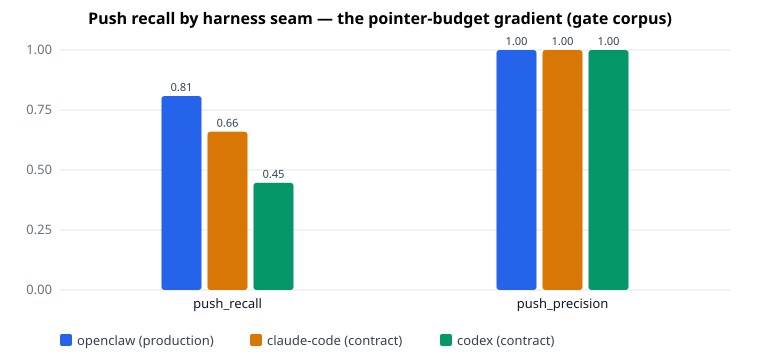
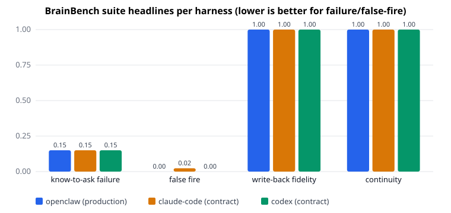

# BrainBench memory conformance — first published run (Cat 34)

**The verdict in one line: gbrain's production push path volunteers the right
memory 81% of the time it should, never injects junk (precision 1.0), never
leaks across sources, and loses zero facts through the write path — while the
two contract seams quantify exactly what tighter injection budgets cost
(recall 0.66 at 2 pointers, 0.45 at 1 fragment).**

| harness (seam) | know-to-ask failure ↓ | false fire ↓ | push recall ↑ | push precision ↑ | write-back fidelity ↑ | continuity ↑ | isolation violations |
|---|---|---|---|---|---|---|---|
| **openclaw (production)** | **0.150** | **0.000** | **0.809** | **1.000** | **1.000** | **1.000** | **0** |
| claude-code (contract) | 0.150 | 0.023 | 0.660 | 1.000 | 1.000 | 1.000 | 0 |
| codex (contract) | 0.150 | 0.000 | 0.447 | 1.000 | 1.000 | 1.000 | 0 |



What changed: agent memory now has a per-harness scorecard. Before this run, a
salience or reflex change shipped on vibes; now every gbrain PR must hold or
move these numbers against a committed baseline that CI compares against
main's copy — a PR cannot rewrite the thing it's graded by.

## What is gbrain

gbrain is a personal-knowledge brain: markdown files as the source of truth,
indexed into embedded Postgres (PGLite) or managed Postgres + pgvector, with
hybrid retrieval (keyword + vector + RRF fusion, source-aware boosts, optional
expansion). Agents reach it over MCP from any harness. The piece under test
here is the memory layer above retrieval: the Retrieval Reflex (deterministic
push of page pointers into context), the conversation→facts write-back
pipeline, and cross-session/cross-harness continuity.
Repo: github.com/garrytan/gbrain.

## What is the benchmark

BrainBench is gbrain's own cross-harness memory conformance suite, shipped in
the gbrain repo (`evals/brainbench/`, methodology `docs/eval/BRAINBENCH.md`)
and driven here through its published foreign-runner contract — this runner
imports zero gbrain internals. Dataset: 141 conversation fixtures / 241
gold-annotated turns across 7 stratified categories (know-to-ask positive +
negative, push-under-budget, write-back, continuity pairs, multi-source,
adversarial), generated deterministically (Mulberry32, seed 42) over a
whole-cloth fictional universe; gold is sealed in separate files and adapters
only ever see sanitized turns. ~15% of fixtures are holdout, excluded from the
gate run reported here. Metrics: failure/false-fire rates, micro-averaged push
precision/recall, write-back fidelity + provenance accuracy, continuity rate,
source-isolation violation count. Why this benchmark: it operationalizes the
four failure modes every agent-memory thesis names — nobody has a push path,
intrusion budgets are unenforced, write is less solved than read, and
continuity dies at the harness hop.

## Adapters tested

All three drive ONE shared pipeline (`extractCandidates` →
`resolveEntitiesToPointers`) with declarative seam configs, so the deltas
between rows are seam constraints, not implementation drift.

**openclaw — seam: production.** The shipped OpenClaw context-engine path
(`src/core/context-engine.ts` → reflex), byte-for-byte: 3-pointer budget,
prior-context suppression, markdown pointer block. This row is what an
OpenClaw user's memory actually does. Result: 0.150 know-to-ask failure /
0.809 push recall / zero false fires.

**claude-code — seam: contract.** The UserPromptSubmit hook wire contract
(`{prompt, session_id, cwd}` → `additionalContext`), 2-pointer budget, and —
the defining constraint — no conversation memory: a hook sees only the current
prompt. Result: identical resolution quality, but 0.023 false-fire rate (it
re-injects what suppression would have held back) and recall capped at 0.660.

**codex — seam: contract.** The fragments model: a static entity-index
preamble computed once (its slugs deliberately don't count as injections —
counting an index would game recall) plus at most one per-turn fragment.
Result: recall 0.447 — a 1-fragment budget simply cannot cover 3-entity turns
— with the preamble's token cost visible in the intrusion diagnostics.

## Results

Head-to-head, gate corpus (118 non-holdout fixtures; counts are gold items):

| System | k/budget | n (gold turns) | LLM in loop? | know-to-ask fail | push R / P | write-back | continuity | Source |
|---|---|---|---|---|---|---|---|---|
| **gbrain reflex via openclaw (production)** | 3 pointers | 146 kta / 94 push | no | **0.150** | **0.809 / 1.000** | **1.000** | **1.000** | this run |
| gbrain via claude-code hook contract | 2 pointers | 146 / 94 | no | 0.150 | 0.660 / 1.000 | 1.000 | 1.000 | this run |
| gbrain via codex fragments contract | 1 fragment | 146 / 94 | no | 0.150 | 0.447 / 1.000 | 1.000 | 1.000 | this run |

No published external system reports these four memory-conformance metrics
today — that absence is the point of shipping the yardstick. The retrieval
layer underneath has its own head-to-heads (see the LongMemEval and
PrecisionMemBench scorecards in this directory); BrainBench rows become
comparable to other memory systems when someone implements an adapter against
the published fixture/result JSON Schemas (`evals/brainbench/schema/`).

## Per-suite breakdown



| harness | kta failed/gold | push failed/gold | write-back failed/gold | continuity failed/gold |
|---|---|---|---|---|
| openclaw | 9/146 | 18/94 | 0/58 | 0/12 |
| claude-code | 11/146 | 32/94 | 0/58 | 0/12 |
| codex | 9/146 | 52/94 | 0/58 | 0/12 |

How the know-to-ask denominators work (the headline 0.150 does NOT equal
9/146): the 146 kta gold turns split into **60 should-retrieve turns and 86
stay-silent turns**. The failure rate is misses over the should-retrieve
subset only — 9/60 = 0.150 — and the false-fire rate is fires over the
stay-silent subset — claude-code's 2/86 = 0.023 (formula:
`know_to_ask_failure_rate = missed / shouldRetrieve`, gbrain
`src/eval/brainbench/metrics/know-to-ask.ts`). The failed/gold column above
sums BOTH failure kinds over both subsets, which is why claude-code shows
11/146: 9 misses + 2 false fires.

Three patterns worth pulling out. First, the know-to-ask failure rate is
0.150 on every seam — those 9 misses (of the 60 should-retrieve turns) are the same 9 gold turns, the corpus's
deliberately-hard lowercase and surname-only mentions that the v1 reflex's
capitalization-biased extractor cannot see (documented limits in
`entity-salience.ts`). That number is the measured roadmap for the next reflex
iteration, not noise. Second, claude-code's two extra know-to-ask failures are
false fires, not misses: with no conversation memory, the hook contract
re-injects pointers production suppression would hold — the bench prices the
missing state, 0.023 per silent turn. Third, push recall is a clean budget
gradient (0.809 → 0.660 → 0.447) at constant precision 1.000: with exact-match
resolution, everything injected is right, and the only question is how much
the seam lets through.

## Intrusion cost (reported, not gated)

| harness | avg injected tokens/turn (kta) | continuity |
|---|---|---|
| openclaw | 33.8 | 75.3 |
| claude-code | 30.9 | 75.3 |
| codex | 40.7 | 150.9 |

codex's static preamble shows up here (its conversation-start index lands on
turn 1), exactly the trade the fragments model makes: cheaper plumbing, double
the context spend on continuity conversations.

## Latency + cost

| Adapter | full run wall | per-fixture | LLM calls | cost |
|---|---|---|---|---|
| all three, full suite | ~7–10 s | ~60 ms | 0 | $0 |

Hermetic by construction: in-memory PGLite, `noEmbed` seeding, deterministic
gold extractor through the production write-back pipeline. The `--llm` mode
(real extractor, budget-capped) is the only paid path and is not part of the
gate.

## Limits & caveats

- **Contract rows are not third-party measurements.** claude-code and codex
  rows grade gbrain's primitives under those harnesses' injection-shape
  constraints; the real integrations land later and flip the seam label with
  continuous numbers. The `seam` column exists so nobody mistakes one for the
  other.
- **Injection conformance, not consumption.** know-to-ask and push score what
  the memory layer surfaced, before any model consumes it. Agent-in-the-loop
  replay is pre-registered (`--live`) and unimplemented.
- **Deterministic ≠ stochastic robustness.** stddev is 0 by construction;
  these numbers say nothing about LLM-extractor variance (that's `--llm`,
  unpublished).
- **write-back 1.000 is a floor check, not a victory.** The deterministic mode
  hands the pipeline perfect extractions; it proves segmentation/insertion/
  provenance lose nothing. Extraction quality itself is the `--llm` metric.
- **push_precision 1.000 is expected to FALL** when fuzzy/semantic resolution
  lands — exact-match arms can't inject junk on this corpus. The pre-registered
  expectation in the methodology doc says so before the fact.
- Holdout fixtures (23) are excluded here; published runs with
  `--include-holdout` will differ slightly.

## Reproduction

```bash
# 1. gbrain checkout carrying BrainBench (Cathedral 2 release, > v0.42.40.0)
git clone https://github.com/garrytan/gbrain && cd gbrain && bun install

# 2. the run this scorecard reports (from the gbrain repo)
bun src/cli.ts eval brainbench --harness all --suite all --json --out /tmp/bb.json

# 3. or through this repo's runner (imports no gbrain internals)
cd ../gbrain-evals
GBRAIN_REPO=../gbrain bun eval/runner/cat34-brainbench-memory.ts
# receipts: eval/reports/cat34-brainbench-memory/{receipt,scorecard,result}.json
```

Wall time ~10 s, zero API keys, zero cost. Corpus rebuild (byte-identical):
`bun evals/brainbench/generator/gen.ts` in the gbrain repo.

## Methodology details

Fixtures hash `76f201590dd3…` (sha256 over every fixture + sealed gold file).
One in-memory PGLite per run, `TRUNCATE`-reset between fixtures; read-only
suites seed once and replay all three adapters against the same brain;
continuity pairs run per ordered (writer ≠ reader) harness pair with the
writer's decisions persisted through the production
`extract-conversation-facts` pipeline via its injectable-extractor seam.
Counts (failed/gold) are the gate; rates are display. Know-to-ask rates use
split denominators: 146 gold turns = 60 should-retrieve + 86 stay-silent;
failure rate = misses/60, false-fire rate = fires/86, failed/gold sums both. Source isolation gates
at zero unconditionally. Full formula definitions: gbrain
`docs/eval/BRAINBENCH.md`; plain-English metric glossary: gbrain
`docs/eval/METRIC_GLOSSARY.md`.

## Files

- `eval/runner/cat34-brainbench-memory.ts` — this runner (subprocess contract only)
- `eval/reports/cat34-brainbench-memory/{receipt.json,scorecard.md,result.json}` — run artifacts
- gbrain: `src/eval/brainbench/`, `evals/brainbench/` (corpus + schemas + committed baseline), `docs/eval/BRAINBENCH.md` — at the Cathedral 2 release commit (gbrain repo `git log --grep BrainBench` for the exact SHA)
- Read-only disclosure: this run mutates nothing outside `eval/reports/`.
