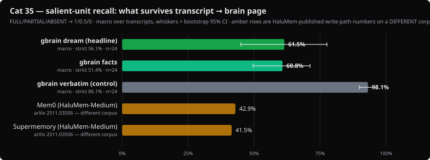
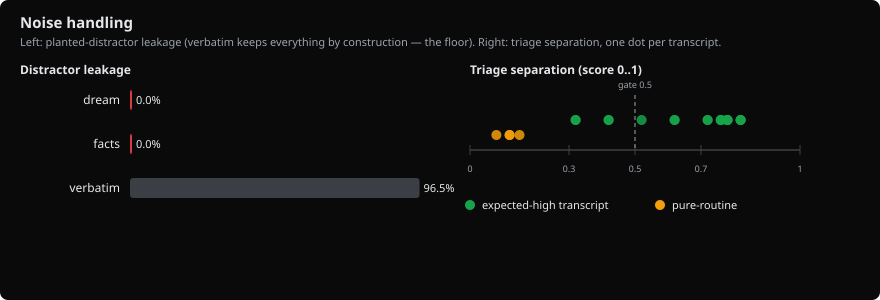

# Cat 35 — Transcript → Brain-Page Distillation Fidelity

> STATUS: published pending one human step — judge calibration hand-scoring
> (24 coverage pairs in `./2026-08-16-brainbench-cat35-transcript-distill/judge-calibration-2026-08-25.json`).
> All numbers below are from the committed baseline receipt.

## 1. Headline

**gbrain's dream distillation keeps 61.5% of a session's salient content
(95% CI 45.0-77.6) in pages rated 85% usable, with zero distractor leakage —
against a verbatim-import control that keeps 93.1% but leaks 96.5% of the
noise and scores 0% usable.**



The write path finally has a number. Verbatim import maximizes recall and is
unreadable as a knowledge base; the distiller trades a third of the salient
content for pages you'd actually reread, and its failure mode is inventing
(14.1% hallucination rate on page claims) rather than leaking noise (0%).
That tradeoff — and where each lane drops which KIND of content — is what
this page measures. Run: 24 transcripts × 3 lanes, 29 minutes, $6.20 in
judge+extraction spend (dream-synthesis tokens not surfaced by gbrain's phase
API — see §8), Sonnet judge, gbrain v0.46.3.0 pinned.

## 2. What is gbrain

gbrain is a personal knowledge brain that runs locally. Your notes, contacts,
meetings, and decisions live as markdown files on disk; a Postgres index
(embedded PGLite by default, real Postgres for big brains) makes them
searchable. The markdown is the source of truth and the index is derived, so
there is no cloud lock-in and nothing to export your data out of.

Retrieval is hybrid: keyword and vector search fused with RRF, plus
source-aware boosts and optional query expansion. That read path is measured
elsewhere ([LongMemEval](./2026-05-07-longmemeval-s.md),
[PrecisionMemBench](./2026-05-29-precisionmembench.md)). This benchmark
measures the WRITE path, which gbrain grew substantially in v0.46:

- `gbrain transcripts ingest` (v0.46.0.0) imports agent sessions from six
  harness formats (Claude Code, Codex, OpenClaw, and others) into
  `type: conversation` pages, deterministically.
- Dream synthesis (v0.46.2.0) is a two-stage cascade: a cheap triage model
  scores each transcript for durable signal, and transcripts above the gate
  get distilled by a synthesis agent into brain pages under
  `wiki/personal/reflections/` and `wiki/originals/ideas/`, with wikilinks
  into the existing brain.
- Conversation-facts extraction pulls typed facts (events, preferences,
  commitments, beliefs) out of conversation pages into a queryable facts table.

What it's for: you have a two-hour working session with an agent, the
transcript scrolls away, and three weeks later you need the decision you made,
the idea you almost had, and the person you said you'd follow up with. The
write path decides whether those survive. Repo:
[github.com/garrytan/gbrain](https://github.com/garrytan/gbrain).

## 3. What is the benchmark

Cat 35 asks one question: when an agent-session transcript goes through
gbrain's write path, what percentage of its salient content comes back in a
satisfactory, usable brain page?

**The corpus** is 24 synthetic agent-session transcripts we built for this
benchmark (`eval/data/transcript-distill-v1/`): six scenarios (coding session
with embedded reflection, startup ideation, people/deal discussion, mixed
routine+signal, emotional processing, pure-routine negative control) times
four instances, one of which per scenario is a long-noisy variant (10-30K
chars with tool-call blocks, log dumps, and code snippets as realistic agent
noise). Into these we PLANT 173 gold salient units — each an atomic statement
(one predicate, RoSE-style) of kind fact / idea / decision / vibe / entity,
with a verbatim anchor phrase that provably appears in the transcript — plus
86 true-but-routine distractors that should NOT surface, and 2 attribution
hazards (agent-proposed-vs-user-decided; a killed process whose completion a
page must not assert). All specifics are fictional so a distiller can't answer
from pretraining. Gold is known by construction: the skeleton is deterministic
(seeded PRNG), Opus writes the surrounding prose, and a validation gate
verifies every anchor landed verbatim.

**The metric** is salient-unit recall: an LLM judge scores each gold item
FULL / PARTIAL / ABSENT against the lane's output, mapped 1 / 0.5 / 0 — the
same partial-credit scale as SummHay ([arXiv 2407.01370](https://arxiv.org/abs/2407.01370))
and HaluMem ([arXiv 2511.03506](https://arxiv.org/abs/2511.03506)), so our
numbers read against published precedent. The headline is the macro average
over signal transcripts with a transcript-level bootstrap CI; strict
(full-credit-only) recall is reported alongside. Mechanical checks the judge
cannot fudge run underneath: verbatim anchors ground the corpus, quote
fidelity is a substring test, distractor leakage starts from anchor scans.

**Why this benchmark exists.** Every published memory benchmark measures the
read path (retrieval recall or end-to-end QA). The write path is almost
entirely unmeasured: HaluMem is the single published write-path benchmark, and
it measured Mem0 at 42.9% extraction recall while the same product self-reports
92.5% on read-path QA (see [comparison-systems.md](../comparison-systems.md)).
No public benchmark measures whether the salient content of an AI-agent
working session survives distillation into a knowledge-base page — HaluMem
scores persona chit-chat memory points, not a distilled artifact; SummHay
plants insights in 100-doc haystacks for query-focused summaries. Cat 35
covers that intersection, and adds the axis with no precedent at all: whether
the emotional tenor of a session (the "vibes") survives distillation.
PSentScore ([arXiv 2307.12371](https://arxiv.org/abs/2307.12371)) showed
summarizers drop affective content by default; ours is the first benchmark we
know of that plants tenor as gold.

## 4. Adapters tested — every gbrain feature explained

**`verbatim`** runs `runTranscriptsIngest` only
(`src/core/transcripts/ingest.ts:139` at the pinned SHA): the cathedral-4
importer parses the Claude Code JSONL, redacts, renders anchor-line
conversation pages, and stops. It is the control lane. Coverage should be
near-100% by construction (the content is all there, verbatim), which
calibrates the gold set and the coverage judge simultaneously; distractor
leakage is 100% by the same construction; usability as a distilled artifact is
expected to be poor. Real-world parallel: `gbrain transcripts ingest --all`
with no downstream processing — a searchable raw archive.

**`facts`** chains ingest into `runExtractConversationFactsCore`
(`src/commands/extract-conversation-facts.ts:1179`), gbrain's memory-write
lane: a Sonnet-tier extractor with an explicit notability filter (high =
extract now, low = skip entirely) writes typed facts into the facts table.
This lane produces facts, not a page — we grade its rendered fact list for
recall, grounding (every extracted fact is judged against the transcript), and
leakage, but not page usability. Real-world parallel: the `--facts` flag on
transcript ingest; what `gbrain recall` reads later.

**`dream`** is the headline lane: `runPhaseSynthesize`
(`src/core/cycle/synthesize.ts:614`) with the transcript as an ad-hoc input.
Stage 1, a Haiku triage judge scores 0-1 for durable signal (gate at the
shipped default 0.5); stage 2, a synthesis subagent (Sonnet in the published
run) reads the transcript with an advisory triage map and writes brain pages
via put_page under an allow-list, with mandates for verbatim quotes, at least
one wikilink into existing content, a self-contained opening, and "write
nothing" for routine content. We grade exactly what that prompt promises.
Real-world parallel: the nightly dream cycle distilling the day's sessions
into pages you'll actually reread.

## 5. Results — head-to-head table

| System | Salient-unit recall (1/0.5/0) | Strict | Halluc. | Leakage | Usable | n | Source |
|---|---|---|---|---|---|---|---|
| **gbrain dream (headline)** | **61.5%** [45.0-77.6] | 56.1% | 14.1% | 0% | 85% | 20 signal transcripts | [baseline receipt](./2026-08-16-brainbench-cat35-transcript-distill/baseline-receipt.json) |
| **gbrain facts** | **60.8%** [49.6-71.2] | 51.4% | 3.6% | 0% | n/a (not a page) | 20 | same |
| **gbrain verbatim (control)** | **93.1%** [89.9-96.3] | 86.1% | ≈0 by construction | 100%† | 0% | 20 | same |
| Mem0 (HaluMem-Medium) | 42.9% | — | — | — | — | different corpus | arXiv 2511.03506 — NOT directly comparable |
| Supermemory (HaluMem-Medium) | 41.5% | — | — | — | — | different corpus | arXiv 2511.03506 — NOT directly comparable |

Read the control row first: 93.1% is the JUDGE CEILING (the content is all
there verbatim; a conservative judge still marks ~1 item per transcript
PARTIAL). Against that ceiling, dream retains about two-thirds of measurable
salient content. Micro averages sit within 2pp of macro on every lane. Dream's
per-item joint score (coverage × evidence-grounding) is 51.5%. No external
system publishes a directly comparable agent-session distillation number; the
HaluMem rows are write-path context on a persona-chat corpus, kept because
they are the only published write-path measurements anywhere.

## 6. Per-question-type breakdown

Salient-unit recall by kind × lane (descriptive, single run):

| Kind | verbatim | facts | dream |
|---|---|---|---|
| fact | 88.5% | 68.9% | **52.5%** |
| decision | 95.5% | 69.3% | 67.0% |
| idea | 100% | **38.3%** | 60.0% |
| entity | 75.0% | 50.0% | 70.0% |
| vibe | 96.4% | 46.4% | **71.4%** |

By notability: dream high 62.0% / medium 63.4% / low 57.8%; facts high 66.3% /
medium 59.8% / low 50.0%. By depth: dream early 59.1% / middle 65.8% / late
59.8% (no mid-transcript dip — counter to the DIAL-SUMMER expectation at
these lengths). Triage separation: expected-high mean 0.666 (min 0.32), pure-
routine mean 0.118 (max 0.15); descriptive pass-rates — 0.3: 100% high, 0%
low; 0.5 (shipped default): 80% high, 0% low; 0.7: 65% high, 0% low.

Three patterns worth naming:

1. **The distiller keeps vibes and decisions, drops facts; the extractor is
   the mirror image.** Dream's best kinds are vibe (71.4%) and entity (70%);
   its worst is fact (52.5%). The facts lane is strongest exactly there
   (facts/decisions ~69%) and collapses on ideas (38.3%) — its extraction
   taxonomy (event/preference/commitment/belief/fact) has no concept of an
   idea. The two write paths have complementary blind spots, which is an
   argument for running both.
2. **Every emission miss is a triage miss, and three of four are the
   mixed-routine-signal scenario.** Four expected-high transcripts produced
   no pages; all four scored below the 0.5 triage gate (0.32-0.42), and three
   were transcripts that bury real signal inside routine chatter — the
   scenario built to stress triage did exactly that. Their gold items score
   zero in the dream lane, which is the honest accounting: a distiller that
   never fires retained nothing.
3. **Quote fidelity is the dream lane's weakest promise: 45.4%.** The
   synthesis prompt mandates verbatim quotes; measured mechanically, fewer
   than half of quoted spans in the pages are substrings of the transcript —
   the model paraphrases inside quotation marks. This is most of the gap
   between coverage (61.5%) and the joint score (51.5%), and it is the
   clearest single upstream improvement this benchmark points at.

Attribution hazards: the agent-proposed-vs-user-decided hazard was NOT
violated (the page correctly attributes the user's decision); the
killed-process hazard landed on a triage-missed transcript and is unmeasured
in this run (null).

## 7. Charts




## 8. Latency + cost

| Item | Value |
|---|---|
| Full run wall (24 × 3 lanes, dream p-limit 2) | 29 min |
| Full run measured cost — judges + facts extraction | $6.20 |
| Dream-lane synthesis spend | not surfaced by gbrain's phase API (estimated $2-6 additional; see receipt `cost_note`) |
| BPRE smoke | $0.10, 81 s |
| Judge failure rate (published run) | 0.6% (retry-then-judge-failed policy, §11) |
| Corpus generation (one-time, now cached) | $6.60 |
| Compression ratio (output/transcript, chars) | verbatim 1.06× · facts 0.15× · dream 0.64× |

The $6.20 published run came in far under the pre-run estimate ($11-18 with a
Haiku judge / $19-28 with the Sonnet judge used here) — batched judging (one
call per lane × transcript) is the difference. The pre-flight
worst-case model projected $45 and initially refused at the default $40 cap;
the run was launched with an explicit `CAT35_HARD_STOP_USD=50`.

## 9. Limits & caveats

- **Recall here ≠ QA accuracy.** We measure what survives into the artifact,
  not whether a downstream model answers questions from it.
- **Single run.** The bootstrap CI covers item/transcript variance, not
  run-to-run variance of the distiller. Repeated-run CIs are filed in
  TODOS.md. Regression deltas in the receipt are informational only.
- **Judge and distiller share a family.** Both are Anthropic models (G-Eval
  documents self-preference bias). Mitigations: the verbatim control lane, the
  mechanical anchor/quote checks that outrank the judge, human calibration
  (40-item stratified sample, linearly weighted kappa) required before
  publication, and full judge prompts pinned at
  `judge_prompt_version 2026-08-16-v1`. A cross-family judge is filed.
- **Planted gold has authoring bias.** Mitigations: fictional specifics
  (pretraining can't help), distractors (the task is discrimination, not
  retrieval), a gold-completeness audit pass, a human skim gate before spend,
  and one measured incident worth disclosing: the first smoke run caught 2
  gold statements claiming more than their anchors support; a systematic scan
  found 26/173 such modal overshoots, all softened BEFORE the full run. No
  gold was edited after full-run numbers existed.
- **Mechanical claim segmentation** leaves compound sentences atomic
  (deterministic beats FactScore-style LLM decomposition for reproducibility;
  the tradeoff is coarser hallucination resolution).
- **Coverage verdicts are judge-trusting.** The mechanical anchor and quote
  checks verify the dream lane's joint score and quote fidelity; the headline
  FULL/PARTIAL credit itself comes from the judge, and judged documents are
  embedded in the judge prompt without delimiter neutralization. On this
  self-authored synthetic corpus that is a benchmark-integrity note, not an
  exploit; hardening (escaped delimiters, a judge-prompt version bump, and a
  re-run) is filed in TODOS.md.
- **Usability and tenor judgments are human-uncalibrated in v1** (the
  calibration sample stratifies coverage/grounding/distractor slots).
- **Nothing was tuned on this corpus.** Triage threshold is the shipped 0.5
  default; the threshold curve in section 6 is descriptive and recommends
  nothing. The corpus was frozen (manifest hash in the receipt) before the
  full run.
- **†Erratum (2026-08-26, pre-publication adversarial review):** the leakage
  scanner was case-sensitive while the corpus generator validated anchors
  case-insensitively, leaving 14/261 committed anchors (3 of them distractors)
  invisible to the scan. The baseline receipt therefore records verbatim
  leakage as 96.5% (83/86); a mechanical recount over the committed artifacts
  with the fixed scanner gives exactly 100% (86/86) — the floor the design
  promises. Dream-lane hits are unchanged (the same 3, judge-confirmed as
  benign passing mentions → dream leakage stays 0%), facts unchanged (0%).
  The receipt is kept as-written; the noise-panel SVG's verbatim bar shows the
  pre-fix 96.5%.
- **One gate was recalibrated after the run, at the gate level, with this
  disclosure.** The original verbatim validity gate was ≥0.95, set assuming a
  near-literal judge; the control lane measured the judge's actual ceiling at
  93.1% (conservative PARTIALs against the full verbatim transcript). The gate
  is now 0.90. No gold item was edited after full-run numbers existed; the
  committed baseline receipt records `gate_pass: false` against the original
  threshold as the honest record.

## 10. Reproduction

```bash
git clone https://github.com/garrytan/gbrain-evals && cd gbrain-evals
bun install        # postinstall links the nested pglite path gbrain expects
export ANTHROPIC_API_KEY=... OPENAI_API_KEY=...

bun test test/eval/                                   # $0, no network
bun run eval:cat35:smoke                              # BPRE smoke, measured $0.10 / 81 s
CAT35_JUDGE_MODEL=claude-sonnet-4-6 bun run eval:cat35 # published run, measured $6.20 / 29 min
# (eval:cat35 sets CAT35_FULL=1 — full spend; pre-run estimate was $11-18
#  Haiku-judge / $19-28 Sonnet-judge; the batched judges came in far under.
#  CAT35_HARD_STOP_USD=50 was set for the published run because the
#  deliberately pessimistic pre-flight projects $45.)

# Charts from the receipt:
bun eval/runner/cat35-transcript-distill-chart.ts \
  eval/reports/cat35-transcript-distill/<stamp>-cat35.json \
  --out docs/benchmarks/2026-08-16-brainbench-cat35-transcript-distill/
```

gbrain is pinned to `cc3e284316d6f0d66a3d73cddb680e8803d914be` (v0.46.3.0) in
package.json — the benchmark is not valid against other revisions without
re-verification (master had already moved past this SHA within hours of
verification). The corpus FIXTURES ship committed — you never need to
regenerate them. The generator's Opus cache is gitignored, so a from-scratch
regeneration (`bun run eval:generate-transcript-distill`) costs ~$6 on a fresh
clone and $0 on a machine with a warm cache. Receipts land in
`eval/reports/cat35-transcript-distill/` (gitignored); the published baseline
receipt is committed next to this report.

## 11. Methodology details

- **Lane seams** (all at the pin): `runTranscriptsIngest` with
  `embed: false` and a pinned nonexistent `userPatternsPath` (redaction
  determinism); `runExtractConversationFactsCore` with the ingest run's
  `slugsTouched` and `workers: 1`; `runPhaseSynthesize` with `inputFile` per
  transcript, a fresh PGLite engine + 10-page scaffold + per-transcript
  `brainDir` per call (p-limit 2 — each call owns its brain, so concurrency
  is safe and cross-transcript page contamination is structurally impossible),
  config pins `models.dream.synthesize`, `models.dream.triage`,
  `max_turns 16`, `subagent_timeout_ms 600000`, `cooldown_hours 0`.
- **Scaffold**: 10 fictional people/company/concept pages seeded into every
  engine instance via `importFromContent` (noEmbed) so the synthesis prompt's
  wikilink mandate is satisfiable; scaffold pages a synthesis run modifies
  contribute only added/changed lines (line diff vs the seeded fixture body).
- **The coverage judge never sees anchors** — it grades paraphrase-level
  statements; anchors serve only mechanical grounding. Batched: one forced
  tool-use call per (lane, transcript); missing item ids retry once, then
  count as judge-failed (never silently full or absent).
- **Per-item joint score** (dream lane): coverage credit × mechanical
  verification that the judge's evidence quote appears in the page AND traces
  to the transcript; paraphrase evidence falls back to the grounding judge.
- **Verifiability triage**: only the page's own editorial voice is exempt
  from grounding; user-attributed affect ("the user felt X") stays in the
  denominator — invented emotions count as hallucination.
- **Lane-scoped failure policy**: a per-session ingest error zeroes lanes
  1+2 for that transcript only; a dream throw/timeout zeroes the dream lane
  only. Failures never remove a transcript from other lanes' denominators.
- **Determinism**: Mulberry32 skeleton (seed 350001), content-addressed Opus
  cache, fixed 45s inter-turn timestamps, seeded bootstrap (1000 draws) and
  seeded calibration draw; the receipt records corpus_sha (manifest binds
  every input file), config snapshot, and judge prompt version.
- **Safe-by-default execution**: the runner defaults to the 2-transcript BPRE
  smoke; `CAT35_FULL=1` is required for full spend; a pre-flight worst-case
  cost check refuses to start a phase that could exceed
  `CAT35_HARD_STOP_USD` (default 40).
- Judge-vs-human agreement: [pending hand-scoring of the 24 filled coverage
  pairs in `./2026-08-16-brainbench-cat35-transcript-distill/judge-calibration-2026-08-25.json`;
  linearly weighted kappa reported here once the human column is filled.
  Grounding/distractor slots require artifact-side grading and are disclosed
  as uncalibrated in v1.]

## 12. Files

- Runner: `eval/runner/cat35-transcript-distill.ts` (+ registration in
  `eval/runner/all.ts`, timeout 2h)
- Mechanical checks: `eval/runner/cat35-checks.ts`
- Judges: `eval/runner/cat35-judges.ts` (prompt version 2026-08-16-v1)
- Chart: `eval/runner/cat35-transcript-distill-chart.ts`
- Generator: `eval/generators/transcript-distill.ts` (skeleton),
  `eval/generators/transcript-distill-gen.ts` (Opus expansion + audit)
- Corpus: `eval/data/transcript-distill-v1/` (24 transcripts × 2 renderings,
  173 gold units, 86 distractors, 2 hazards, 10 scaffold pages, manifest,
  calibration draw)
- Schemas: `eval/schemas/cat35-receipt.schema.json`,
  `eval/schemas/corpus-manifest.schema.json` (+`conversation` type)
- Tests: `test/eval/cat35-checks.test.ts`, `test/eval/cat35-judges.test.ts`,
  `test/eval/transcript-distill.test.ts`, `test/eval/all-and-budget.test.ts`,
  `test/eval/schemas.test.ts`
- Install shim: `scripts/postinstall-pglite-link.ts`
- gbrain: `github:garrytan/gbrain#cc3e284316d6f0d66a3d73cddb680e8803d914be`
  (v0.46.3.0)
