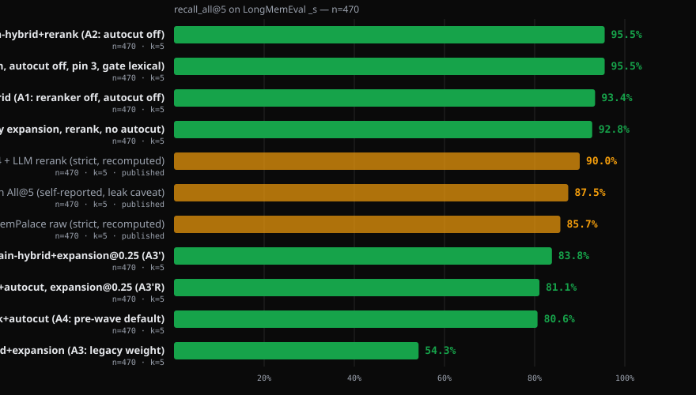
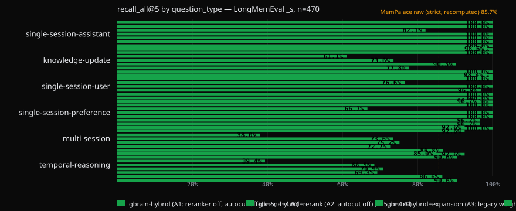

# BrainBench: LongMemEval ranker wave (gbrain v0.48.3.0)

**Status:** receipts complete; the gbrain commit pin below is filled when the gbrain PR opens.
**Date:** 2026-09-06
**gbrain commit:** TBD (PR head SHA; the sibling pin moves to the merge SHA after landing)
**Dataset:** `xiaowu0162/longmemeval-cleaned`, `longmemeval_s_cleaned.json`, sha256 `d6f21ea9d60a0d56f34a05b609c79c88a451d2ae03597821ea3d5a9678c3a442`, 500 questions, 30 abstention (`_abs`) excluded from recall denominators → 470 scored.
**Harness:** `gbrain eval longmemeval` (the in-repo command; this wave made it the receipt producer), one in-memory PGLite per run, TRUNCATE between questions, content-addressed embedding cache (`openai:text-embedding-3-large` @ 1536, every arm sees byte-identical vectors), k = 5 chunk rows, strict `recall_all@5` over the distinct sessions among those rows.

## 1. Headline

**gbrain's release default scores 95.53% strict `recall_all@5` on LongMemEval-S (449/470) — up from 80.64% for the default that shipped before this wave — and publishes its first judged answer-accuracy number, 86.6% (433/500), with no comparison claim.**



Three ranking defaults moved, each on a pre-registered receipt, and two candidate mechanisms that failed their rules did not ship as defaults:

- **Autocut off** in `balanced`/`tokenmax`: the post-rerank score cut kept the best session and dropped the rest on multi-part questions (379 → 449 of 470 strict; any-hit unchanged).
- **Relational pin** (`search.relational_rerank_pin=3`): graph-derived answers no longer sink under the text reranker (NamedThingBench relational hit@1 3/39 → 21/39, zero losses elsewhere).
- **Metadata boost gate** (`search.metadata_boost_gate=lexical`): hub pages no longer outrank the matching concept page when only the vector arm voted (Cat 13 held-out nDCG@5 53.0 → 57.8).
- **Not shipped as defaults:** the expansion budget knob (real, 255 → 394 of 470, but still 43 behind plain hybrid on the decision set) and the keyword-arm confidence floor (53.0 → 53.0).
- **Judged answer accuracy 86.6%** (500/500 judged, 0 judge errors): retrieval delivered every gold session on 449/470 questions and the default reader converted 396 of them; the pre-registered ≥ 92% prediction was missed and the loss is the answering layer.

Three things changed in gbrain's ranking pipeline in this wave, each on a
pre-registered receipt: graph-derived answers are no longer buried by the
cross-encoder reranker (`search.relational_rerank_pin`), well-connected hub
pages no longer outrank the page that actually matched on paraphrased
concept questions (`search.metadata_boost_gate`), and LLM multi-query
expansion is fused under a fixed weight budget instead of one vote per
variant (`search.expansion_variant_budget`; a real lever that still failed its rule, so it ships as an operator knob). The rest of this
report is the evidence for each, including the two mechanisms that did NOT
pass their rules and therefore did not ship as defaults.

## 2. What is gbrain

gbrain is a personal knowledge brain that runs locally. Your notes, contacts,
meeting summaries, decisions and imported chat history live as markdown
files on disk; gbrain keeps a derived index in Postgres (or embedded PGLite)
with full-text search, vector embeddings and a typed-edge graph between
pages. The files are the source of truth; the index can be rebuilt from
them at any time. There is no cloud lock-in: an agent harness (Claude Code,
Codex, OpenClaw, Cursor) talks to gbrain over a CLI or MCP server and the
data never leaves your machine unless you point it at a managed Postgres.

Retrieval is hybrid. A query fans out to a keyword arm (BM25 over
`tsvector`), a vector arm (HNSW over chunk embeddings), a title-phrase arm
and, for questions shaped like "who invested in X" or "what connects A and
B", a relational arm that walks the typed-edge graph. The arms are fused by
reciprocal rank fusion, re-scored, boosted by metadata (backlinks, recency,
salience, graph adjacency), de-duplicated, then optionally reranked by a
cross-encoder and trimmed by a score-discontinuity cut. Each layer is a
config key with a receipt behind it; this report is about four of those keys.

What it is for: capturing what you learn and whom you meet, and getting it
back weeks later when the context is gone — the preference you stated in
March, the two people you met at different events who turn out to work on
the same problem, the decision you made and the reason you gave. The
benchmark below is the closest public proxy for that workload.

Repo: <https://github.com/garrytan/gbrain> · CLI README: <https://github.com/garrytan/gbrain#readme>

## 3. What is the benchmark

LongMemEval (Wu et al., 2024; paper <https://arxiv.org/abs/2410.10813>,
data <https://huggingface.co/datasets/xiaowu0162/longmemeval-cleaned>)
tests long-term interactive memory for chat assistants. Each of the 500
questions comes with a haystack of ~50 chat sessions (the `_s` split), and
the answer depends on one or more of those sessions. Six question types:
single-session-user, single-session-assistant, single-session-preference,
multi-session, knowledge-update, temporal-reasoning; 30 questions are
abstention questions (`_abs`) whose gold is "this was never discussed".
Ground truth for retrieval is `answer_session_ids`; ground truth for answer
accuracy is a short gold answer scored by an LLM judge with the official
prompts (`evaluate_qa.py`).

We report the official retrieval metric, **`recall_all@5`**: a question
counts only when EVERY gold session is among the top-5 distinct sessions
retrieved. The loose diagnostic `recall_any@5` (any one gold session in the
top 5) is published alongside because it is the number most systems'
"retrieval recall" tables actually show. We also publish, for the first
time, a **judged answer-accuracy** row (§6) — the metric memory vendors
publish — with the full protocol disclosed and no cross-system claim.

Why this benchmark: it stresses the failure that a personal brain actually
has — near-duplicate sessions about the same topic where the wrong one
outranks the right one — and it has six typed slices, so a fix that helps
temporal questions while hurting knowledge-update questions shows up as
such instead of washing out in an average.

## 4. Arms — every gbrain configuration explained

| Arm | Configuration | Purpose |
|---|---|---|
| A1 | balanced, reranker off, autocut off | like-for-like with the 2026-09-02 receipt (parity gate) |
| A2 | balanced, reranker on (voyage:rerank-2.5), autocut off | reranker effect, cross-check |
| A3 | balanced, reranker off, LLM multi-query expansion (variants recorded) | the tokenmax regression reproduced |
| A4 | balanced, reranker on, autocut on (shipped default), pool captured | decision baseline; autocut floor replay source |
| dev sweep | A3 variants replayed at expansion budgets {2.0, 1.0, 0.5, 0.25} on the 40-question dev slice | knob selection (never on the decision set) |
| A3′ / A3′R | chosen budget, reranker off / `tokenmax` with reranker on | mechanism receipt / the configuration tokenmax users run |
| final | all receipted flips applied | release-configuration gate |

Decision set: 430 questions (470 minus the seed-42 dev slice of 40; `evals/longmemeval/splits-seed42.json` in gbrain). Rules are integer question counts, pre-registered in the plan before any run.

**A1 `gbrain-hybrid`** runs `hybridSearch(engine, query, {limit: 5})` with
`search.mode=balanced`, `search.reranker.enabled=false`, `search.autocut=false`.
Keyword + vector + title arms fused by RRF, metadata boosts, dedup. This is
the row every earlier gbrain LongMemEval receipt reports and the parity gate
for the new harness. *Real-world parallel:* the default answer to "what did
I say about the dealership visit" when no reranker key is configured.

**A2 `gbrain-hybrid+rerank`** is A1 plus the cross-encoder
(`applyReranker`, `voyage:rerank-2.5`, `reranker_top_n_in` 25). The
reranker reads the query and each candidate chunk together and reorders
the pool. *Why it matters here:* the misses left after fusion are ranking
misses among sessions that are all in the pool, exactly what a
cross-encoder fixes. *Real-world parallel:* two meeting notes about the
same company, only one of which answers the question you asked.

**A3 `gbrain-hybrid+expansion`** is A1 plus `expandQuery` (a Claude Haiku
call that rewrites the question into alternative phrasings); each variant
is embedded and fused as its own vector list. Variants are recorded per
question so later cells can replay them. *Why it matters:* it is what
`search.mode=tokenmax` does, and on this benchmark it has been the largest
regression on record.

**A4 `gbrain-default`** is the configuration a fresh `gbrain init` runs:
reranker on, autocut on (floor 0.35). Its post-rerank candidate pool is
captured per question (`--capture-pool`) so every autocut floor can be
replayed offline from ONE reranker pass.

**A3′ / A3′R** replay A3's recorded variants under
`search.expansion_variant_budget=b`: the variant lists share one total RRF
weight `b` (`weight_i = b / n_voting_variants`, `fusion-lists.ts`) instead of
one full vote each. A3′ is balanced with the reranker off (the mechanism
receipt against A1); A3′R is `tokenmax` with the reranker on (what tokenmax
users actually run, against A4).

Two more receipts in this report come from other fixtures because the
mechanism under test never fires on LongMemEval:

**NamedThingBench reranker A/B (rule R1)** — 50 paired questions on an
entity/graph corpus (`scripts/r1-namedthing-rerank-ab.ts` in gbrain):
11 entity-core questions and 39 graph-relationship questions ("who invested
in acme-example"). Arms: reranker off, reranker on, reranker on + relational
pin, reranker on + pin + autocut, and the metadata gate.

**Cat 13 conceptual recall** (`eval/runner/cat13-conceptual.ts`, this repo)
— 548 seeded paraphrase probes over 30 concept pages in the world-v1
corpus, Voyage `voyage-4` @ 1024 for every adapter, 20 tuning / 10 held-out
concepts (seed 42). Adapters: bare vector, gbrain hybrid, grep-only, and a
vector+grep RRF reference.

## 5. Results — retrieval

### 5.1 LongMemEval arms

Strict `recall_all@5` (every gold session among the top-5 distinct sessions), 470 scored questions; the 430-question column excludes the seed-42 dev slice and is the one every decision was made on. "Paired" is per question against A1.

| Arm | recall_all@5 (470) | recall_any@5 (470) | paired vs A1 (470) | recall_all@5 (430 decision set) | paired vs A1 (430) |
|---|---|---|---|---|---|
| A1 hybrid, reranker off, autocut off | **439/470 (93.40%)** | 464/470 (98.72%) | +0 / −0 | 403/430 (93.72%) | +0 / −0 |
| A2 hybrid + reranker (autocut off) | **449/470 (95.53%)** | 469/470 (99.79%) | +18 / −8 | 412/430 (95.81%) | +16 / −7 |
| A3 hybrid + LLM expansion (legacy: weight 1 per variant) | **255/470 (54.26%)** | 399/470 (84.89%) | +3 / −187 | 231/430 (53.72%) | +2 / −174 |
| A4 shipped default BEFORE this wave (reranker on, autocut 0.35) | **379/470 (80.64%)** | 467/470 (99.36%) | +16 / −76 | 344/430 (80.00%) | +14 / −73 |
| A3′ hybrid + expansion at budget 0.25 (reranker off) | **394/470 (83.83%)** | 458/470 (97.45%) | +3 / −48 | 360/430 (83.72%) | +2 / −45 |
| A3′R tokenmax (expansion at 0.25, reranker on, autocut 0.35 as tokenmax shipped it) | **381/470 (81.06%)** | 466/470 (99.15%) | +12 / −10 vs A4 | 347/430 (80.70%) | +12 / −9 vs A4 |
| tokenmax as released by this wave (legacy expansion weight, reranker on, autocut off) | **436/470 (92.77%)** | 468/470 (99.57%) | +2 / −15 vs A2 | 400/430 (93.02%) | +2 / −14 vs A2 |
| **final release configuration** (`balanced`: reranker on, autocut off, relational pin 3, metadata gate lexical) | **449/470 (95.53%)** | 469/470 (99.79%) | +18 / −8 | 412/430 (95.81%) | +16 / −7 |

Per type (`recall_all@5`, 470):

| Type | n | A1 | A2 = release default | A3 | A4 | A3′ | tokenmax as released |
|---|---|---|---|---|---|---|---|
| knowledge-update | 72 | 71 | 72 | 44 | 53 | 65 | 72 |
| multi-session | 121 | 112 | 112 | 46 | 89 | 91 | 105 |
| single-session-assistant | 56 | 56 | 56 | 46 | 56 | 56 | 56 |
| single-session-preference | 30 | 29 | 30 | 20 | 30 | 30 | 29 |
| single-session-user | 64 | 63 | 64 | 49 | 64 | 62 | 64 |
| temporal-reasoning | 127 | 108 | 115 | 50 | 87 | 90 | 110 |

**Parity gate (A1).** The in-repo harness reproduces the 2026-09-02 sibling receipt (438/470, produced by this repo's runner at gbrain 172df271): 439/470, 469 of 470 rows agree per question, any-hit identical at 464/470, per-type identical except one temporal-reasoning question that flipped to a hit without a shared embedding cache. `gbrain eval longmemeval` is therefore the receipt producer from this wave on. Embedding cache: A2 and every replay arm ran with 0 cache misses (byte-identical vectors); A1 was the cache-building arm; A3 missed once per new Haiku variant string.

**The reranker (A2 vs A1).** +18 / −8, every gain outside multi-session (112 both ways), the largest in temporal-reasoning (108 → 115). Any-hit 99.79%: the reranker promotes sessions already in the pool.

**Autocut (A4 vs A2, rule R2).** The configuration that shipped before this wave — reranker on, then a cut at the largest rerank-score cliff — scores 379/470 against 449/470 with the cut off: +0 / −68 on the 430, the losses entirely in the three types whose questions need more than one session (multi-session −22, temporal −27, knowledge-update −19). Any-hit is unchanged (99.36%): the cut keeps the best session and drops the rest. Replaying every floor from A4's captured post-rerank pool (`longmemeval/phaseC-autocut-floor-replay.md`; the replay reproduced all 500 live decisions first):

| floor | recall_all (500 captured rows) | autocut applied | mean returned rows | mean returned est. tokens |
|---|---|---|---|---|
| off | 475 | 0 | 5.00 | 3256 |
| 0.10 / 0.20 / 0.35 | 399 | 365 | 2.49 | 1633 |
| 0.50 | 413 | 307 | 2.88 | 1875 |
| 0.65 | 444 | 187 | 3.67 | 2382 |
| 0.80 | 466 | 91 | 4.33 | 2817 |

The same monotone shape holds on both seeded halves and no floor is within two questions of "off" on either (0.80 still loses 9, all knowledge-update). The pre-registered chain therefore ends at **autocut off in `balanced` and `tokenmax`** (the module default stays for operators who re-enable it; a session-aware cut that never trims below k distinct sessions is the filed follow-up). The token saving autocut delivered was real — half the returned window — and it was paid for with the second gold session.

**Expansion (A3, A3′, rule for the budget knob).** Legacy expansion (one full RRF vote per Haiku variant) reproduces the published regression: 255/470, +3 / −187. Budget-normalized fusion is a real mechanism — the dev-slice sweep on frozen variants climbs monotonically as the variants' share shrinks (24 → 26 → 30 → 34 of 40 at budgets 2.0 → 1.0 → 0.5 → 0.25, plain hybrid 36), and A3′ at the picked budget 0.25 recovers 139 questions over A3. It still fails its pre-registered rule: 360 vs 403 on the 430 (−43; multi-session −20, temporal −17). A3′R, the configuration tokenmax users ran before this wave with the budget applied, scores 381/470 against A4's 379 (+3 on the 430) — the literal rule passes, but both arms sit under autocut 0.35, which trims the returned set to about 2.3 sessions and pins strict recall near 80% whatever fused upstream, so the row says "under the cut, budgeted expansion plus reranker equals no expansion plus reranker", not that expansion earns its keep. With the mechanism receipt (A3′ vs A1) failed, the flip is not justified. The bundles therefore keep the legacy weighting (`expansion_variant_budget: null`), the knob ships for operators who keep expansion on (`gbrain config set search.expansion_variant_budget 0.25` recovers most of the loss), and the honest reading stands: at k=5 on this corpus, LLM multi-query expansion is harmful, and the fix the receipts point at is conditional expansion (expand only when the original query's evidence is weak), filed as the next pre-registered mechanism.

**Final release configuration (gate D11).** All flips applied (reranker on, autocut off, relational pin 3, metadata gate lexical) on the release SHA: 449/470, byte-identical per question to A2 — on this corpus the pin never fires (no relational intent) and the gate changes no top-5 (chat sessions carry no backlinks or graph edges). Against the default that shipped before the wave (A4): +68 / −0 on the 430, every type gains or holds. NamedThingBench in the same shape (`namedthing-r1/r1-namedthing-release-receipt.json`): core hit@1 10 → 11, relational 21/27 in both arms, zero losses; BrainBench and the retrieval canary unchanged. Gate passed on every leg; no flip was reverted. **tokenmax as released** (legacy expansion, reranker on, autocut off) scores 436/470 (+2 / −15 against the balanced release path: multi-session −7, temporal −5): the reranker repairs most of what equal-weight expansion breaks, the budget knob does not close the rest, and `balanced` stays the small-k recommendation.

### 5.2 NamedThingBench reranker A/B (rule R1) and the relational pin

| Arm (balanced) | core hit@1 (11) | core hit@3 (11) | graph-relationship hit@1 (39) | graph-relationship hit@3 (39) | paired losses vs reranker off |
|---|---|---|---|---|---|
| reranker off, autocut off | 10/11 | 10/11 | 21/39 | 27/39 | — |
| reranker on | 11/11 | 11/11 | **3/39** | **5/39** | 19 hit@1, 22 hit@3 |
| reranker on + `relational_rerank_pin=3` | 11/11 | 11/11 | 21/39 | 27/39 | 0 hit@1, 0 hit@3 |
| reranker on + pin + autocut on (shipped shape) | 11/11 | 11/11 | 21/39 | 27/39 | 0 hit@1, 0 hit@3 |
| … + `metadata_boost_gate=lexical` | 11/11 | 11/11 | 21/39 | 27/39 | 0 hit@1, 0 hit@3 | (identical)

The cross-encoder scores chunk TEXT. A graph-derived answer ("fund-a" for
"who invested in acme-example") is a page whose text need not mention the
entity in the question, so the reranker demoted the correct investor page
below pages that merely mention the words. The pin re-inserts up to three
relational-arm rows above the reranked text rows in their fused order;
pinned rows survive autocut. Rule R1 ("balanced stays on iff 0 hit@1 and
≤ 1 hit@3 losses") passes with the pin; balanced reranker stays on.
Receipts: `namedthing-r1/*.json`.

### 5.3 Cat 13 conceptual recall (held-out concepts, nDCG@5)

| Arm | tuning (359 probes) | held-out (181 probes) | held-out P@1 |
|---|---|---|---|
| bare vector (voyage-4) | 59.6 | **60.5** | 65.2 |
| gbrain, reranker off / autocut off (E0-V1) | 50.6 | 53.0 | 48.1 |
| gbrain, shipped default (E0-V4) | 53.9 | 55.8 | 63.5 |
| gbrain + `keyword_arm_confidence_floor=0.6121`, off/off (E2-V1) | 50.8 | 53.0 | 48.1 |
| gbrain + `metadata_boost_gate=lexical`, off/off (E3-V1) | 57.3 | **57.8** | 56.4 |
| gbrain + gate, shipped default (E3-V4) | 56.7 | **57.9** | 65.7 |

Pre-registered rules and outcomes:

- **E2 (arm-confidence floor):** held-out hybrid ≥ bare vector. FAILED
  (53.0 → 53.0). The calibration receipt (`cat13/E2-calibration/`) showed
  83% of the probes where the keyword top hit was not gold had an EMPTY
  keyword arm — the keyword-noise hypothesis explains little of the gap.
  The knob ships off.
- **E1 localization** (`cat13/E1-localize/localize.md`): re-simulating the
  pipeline stage by stage on the tuning split put the loss in the
  post-fusion metadata boosts — hub pages carried 1.03–1.12x backlink /
  graph-adjacency / recency boosts that the gold concept page never
  carried, whenever the vector arm was the only voter (73 of 105 gaps,
  0 collateral when gated).
- **E3 (metadata boost gate):** held-out ≥ 57.0 (E0-V1 + 4), written before
  the run. PASSED at 57.8; tuning 57.3 matched the projection exactly;
  NamedThingBench (50/50), BrainBench, the retrieval canary and the
  LongMemEval dev slice (40/40) were byte-identical → `lexical` is the
  default in every bundle. The stretch (bare vector 60.5) is not met: the
  remaining 2.7 points are the keyword arm's own votes on probes where it
  does match, and are filed as a follow-up.

### 5.4 Temporal reasoning: located, not fixed

Half-A diagnostics of A1's misses (`longmemeval/phaseB-halfA-miss-diagnostics.md`):
every missed gold session sits at vector rank 6–15 and its fused rank equals
its vector rank — the loss is the embedding ranking of near-duplicate
sessions, not fusion, boost demotion, pre-fusion pool depth or reranker
depth (both 0). The clause-decomposition signature held on 1 of 10 misses,
below any rule, so no temporal knob landed. The reranker (A2 vs A1: temporal 108 → 114 of 127) is the lever that moves this class.

## 6. Results — judged answer accuracy

**433/500 = 86.6%** (95% bootstrap CI 83.6–89.6, question-sampling only); 500/500 judged, 0 judge errors, 0 budget skips (`complete: true`); non-abstention 404/470 (86.0%); abstention 29/30 (96.7%). Per type: single-session-assistant 56/56 (100%), single-session-user 69/70 (98.6%), knowledge-update 70/78 (89.7%), multi-session 111/133 (83.5%), temporal-reasoning 107/133 (80.5%), single-session-preference 20/30 (66.7%). Evidence versus verdict on the 470: every gold session retrieved and correct 396; retrieved but judged wrong 53; incomplete evidence but correct 8; incomplete and wrong 13 — the reader converts 88.2% of evidence-complete questions, so the shortfall is the answering layer (preference and temporal questions most of all). Pre-registered prediction ≥ 92%: **missed**. Receipt: `longmemeval/D1-judged-release-config-sonnet46-reader-gpt4o-judge.ndjson`.

| System | Judged QA accuracy | Reader / judge | Comparable? |
|---|---|---|---|
| **gbrain v0.48.3.0 (this run)** | **86.6% (433/500)** | claude-sonnet-4-6 reader, gpt-4o judge, official prompts | — |
| OMEGA (2026) | 95.4% (self-reported) | undisclosed reader/judge | no — protocol unmatched |
| Mastra | 94.87% | GPT-5-mini reader, own architecture | no — protocol unmatched |
| Mem0 | 93.4% (self-reported) | own reader/judge | no — protocol unmatched |

Protocol (fixed before the run, disclosed in full): retrieval = the release default (`balanced`, `voyage:rerank-2.5` on, autocut off, k=5 chunk rows); reader = gbrain's default reader model, provider snapshot `claude-sonnet-4-6`, `max_tokens` 512, system prompt sha `7d991ff3e789…` (adds an abstention instruction — a disclosed deviation from the official reading prompt); reader context = the FULL text of every distinct session among the retrieved rows in `<chat_session>` blocks (each row records `reader_context_chars`, `reader_context_sessions`, `reader_sessions_truncated`); judge = `openai:gpt-4o`, the official `evaluate_qa.py` prompt per question type, temperature 0, `max_tokens` 16 (the OpenAI API's minimum — the official 10 is rejected; a one-token yes/no verdict is unaffected), gold and hypothesis inside a data-boundary wrapper (disclosed deviation); `judge_error` rows are re-judged until zero and any survivor is scored incorrect in the headline. Two dry-run defects were caught before spend and fixed: every judge call failed at max_tokens 10, and the reader saw only the first 4000 characters of each session (an extractor-era sanitizer cap), which made it abstain on 11/25 questions whose gold session was retrieved at rank 1. Comparison rows (Mastra 94.87%, Mem0 93.4%, OMEGA 95.4%) are listed as **not directly comparable** — reader, prompts, judge and dataset revision differ — and this row makes **no SOTA claim**.

## 7. Charts

Generated by `eval/runner/longmemeval-chart.ts` from `longmemeval/ranker-wave-arms.json` (the harness receipts converted with `longmemeval/harness-to-runner-output.py`).



## 8. Latency + cost

The harness runs in bounded resume passes, so wall-clock per arm is the sum of its passes (PGLite in-memory, one brain per question, embeddings from the shared cache after the first arm). Per-question latency percentiles are not stamped on rows this release (filed).

| Arm | mean wall / question | arm wall |
|---|---|---|
| gbrain-hybrid (A1: reranker off, autocut off) | 15.0 s | 7505 s |
| gbrain-hybrid+rerank (A2: autocut off) | 4.8 s | 2401 s |
| gbrain-hybrid+expansion (A3: legacy weight) | 5.9 s | 2974 s |
| gbrain-hybrid+rerank+autocut (A4: pre-wave default) | 3.8 s | 1909 s |
| gbrain-hybrid+expansion@0.25 (A3') | 8.2 s | 4117 s |
| gbrain-hybrid tokenmax+rerank+autocut, expansion@0.25 (A3'R) | 4.8 s | 2421 s |
| gbrain-hybrid tokenmax as released (legacy expansion, rerank, no autocut) | 4.8 s | 2417 s |
| gbrain-hybrid release default v0.48.3.0 (rerank on, autocut off, pin 3, gate lexical) | 4.8 s | 2403 s |

Cost (the $75 cap was enforced by `scripts/eval-spend-guard.sh`; the ledger books launch estimates, so real spend is estimated here): building the embedding cache once ≈ $2 (OpenAI text-embedding-3-large); each reranked retrieval arm ≈ $0.50 of Voyage rerank; the legacy expansion arm ≈ $1 of Haiku variants (replayed for free afterwards); Cat 13 + NamedThingBench ≈ $3; the judged lane ≈ $30 (a Sonnet reader over ~64K characters of context per question plus a gpt-4o verdict; about $0.05 per question, plus three dry runs and three partial passes lost to a harness bug fixed mid-wave). Wave total ≈ $55 real, ≈ $60 booked.

## 9. Limits & caveats

- Retrieval recall ≠ answer accuracy; §6 measures the latter with a disclosed protocol and no cross-system claim.
- The 40-question dev slice is inside the published 470; read the 430-question decision-set column for any knob that was selected on the dev slice.
- Expansion variants are non-deterministic; budget cells are compared on ONE recorded draw of variants.
- Reranker rows depend on a hosted model snapshot (`voyage:rerank-2.5`); the harness records the model and fails a run that silently fell open.
- Cat 13 is a synthetic probe set over a 30-concept corpus; the held-out split guards against tuning on it but not against the templates themselves.
- The NamedThingBench relational fixture is small (39 questions); the pin's cost (a wrong edge now lands at the top rather than the end of page 1) is documented, not measured on a noisy graph.
- Single run per arm; CIs are question-sampling uncertainty only.

## 10. How to reproduce

```bash
mkdir -p ~/datasets/longmemeval && curl -Lo ~/datasets/longmemeval/longmemeval_s_cleaned.json \
  https://huggingface.co/datasets/xiaowu0162/longmemeval-cleaned/resolve/main/longmemeval_s_cleaned.json
export OPENAI_API_KEY=… VOYAGE_API_KEY=… GBRAIN_EMBEDDING_MODEL=openai:text-embedding-3-large GBRAIN_EMBEDDING_DIMENSIONS=1536
DS=~/datasets/longmemeval/longmemeval_s_cleaned.json
COMMON="--retrieval-only --top-k 5 --by-type --no-trajectory --embed-cache ~/.cache/gbrain-eval/longmemeval-embed.sqlite"
gbrain eval longmemeval $DS $COMMON --mode balanced --reranker off --autocut off --output A1.ndjson
gbrain eval longmemeval $DS $COMMON --mode balanced --reranker on  --autocut off --output A2.ndjson
gbrain eval longmemeval $DS $COMMON --mode balanced --reranker off --autocut off --expansion --output A3.ndjson
gbrain eval longmemeval $DS $COMMON --mode balanced --reranker on  --autocut on --capture-pool --output A4.ndjson
# Cat 13 (this repo; CAT13_EMBEDDING_MODEL=voyage:voyage-4 CAT13_EMBED_DIMS=1024): bun eval/runner/cat13-conceptual.ts --reranker off --autocut off --search-pin search.metadata_boost_gate=lexical   # E3-V1; E3-V4 = --reranker on --autocut on
# NamedThingBench R1 (gbrain repo): bun run scripts/r1-namedthing-rerank-ab.ts --autocut on --relational-pin 3
```
