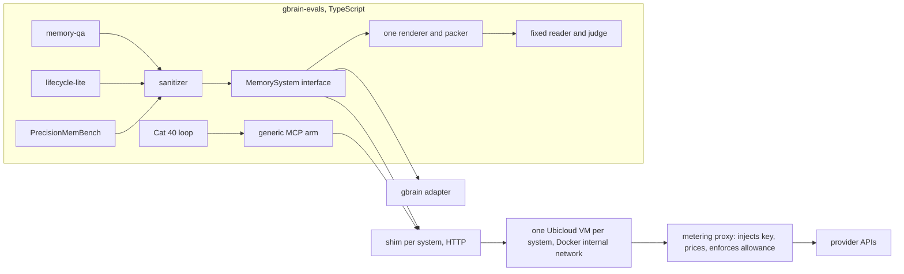

# Open-source memory shootout: gbrain against Graphiti, Cognee, Mem0, Letta, Basic Memory and Hindsight

Status: approved by Garry on 2026-10-05 (D1 yes, D2 option A, D3 deferred, D4 not posted without asking). v2, amended after the autoplan CEO phase (Claude and GPT-6 Astra voices); engineering-phase amendments follow in the review record.
Review files: `~/.capy/work/shootout-review/` (summarized in [Review record](#review-record)).

## The question

When an agent needs memory, an engineer can choose gbrain or one of six popular open-source systems. Which finds the
evidence, lets a fixed reader answer correctly, keeps facts current, forgets on request and helps an agent finish
real work, at what ingest cost, query cost and latency? We lack a matched, reproducible comparison of these six
open-source releases against gbrain. Vendor numbers use their own harness, reader, judge and budget
([comparison page](../../comparison-systems.md)), and Mem0's and Zep's headline scores describe their managed
platforms, not the open-source code. The Agent Memory Benchmark (AMB) is related prior work with its own adapters;
we reuse its contracts where they fit and cite it, rather than rebuild what exists.

This plan runs gbrain and the six systems through one harness on the same data, with one reader and judge per
benchmark, and publishes every result, including the ones gbrain loses. The output is a workload-by-workload guide
for choosing a memory system, not a single leaderboard.

## The systems, pinned

Versions checked 2026-10-05. Phase 0 turns each row into a **capability record**: install command and extras,
resolved dependency lock and image digest, every model role (extraction, small model, embedder and dimensions,
reranker), background jobs and their readiness signal, namespace and provenance mechanism, and MCP wrapper identity.
A later version is a new run, never an edit.

| System | Pin | License | Design | Backend | Write / read API | Provenance to source session | Agent (Cat 40) surface |
|---|---|---|---|---|---|---|---|
| gbrain | repo pin `739e5cc` (v0.60.46.0) and master frozen at one SHA on the preregistration date | MIT | Markdown + index, hybrid search, typed links | PGLite | existing in-process path, refactored behind the new interface | page = session | `gbrain serve --surface starter` |
| Graphiti (OSS, not Zep) | `graphiti-core` 0.30.2; MCP `mcp-v1.1.0` | Apache-2.0 | temporal knowledge graph, facts with validity windows | Neo4j 5.26 | `add_episode(reference_time=…)`, `search_` | edge and node `episodes` | vendor MCP over HTTP |
| Cognee | `cognee` 1.6.2; `cognee-mcp` 0.5.6 | Apache-2.0 | knowledge graph with `recall` routing | SQLite + LanceDB + Kuzu | `add` + `cognify`, `recall(only_context=True)` | chunk `data_id` / evidence references (verify) | vendor MCP |
| Mem0 (OSS, not the platform) | `mem0ai` 2.2.1 | Apache-2.0 | LLM-extracted memories | Qdrant | `add(messages, metadata)`, `search` | per-memory metadata | harness MCP wrapper over the same SDK (OpenMemory is being sunset) |
| Letta | Letta Code 0.34.4 App Server, local backend | Apache-2.0 | stateful agent with memory blocks and archival memory | local | archival insert / search, if Phase 0 proves it | passage tags (verify) | native Letta agent, separate table |
| Basic Memory | `basic-memory` 0.23.2 | AGPL-3.0 | Markdown notes, SQLite FTS, local semantic search + reranker | SQLite | write note, `search_notes` | one note per session | vendor MCP (stdio) |
| Hindsight | server and `hindsight-client` 0.10.2 | MIT | memory banks, `retain` / `recall` / `reflect`, observations | Postgres + pgvector | `retain(…, timestamp, document_id)`, `recall` | `document_id`, `chunk_id` | vendor MCP (`/mcp/{bank}`) |

Letta stays in scope either way. If Phase 0 finds no passive memory API at 0.34.4, Letta runs only as a native agent
on the Cat 40 tasks, in its own table, because its agent loop is not the harness loop.

## Categories, in priority order

| Priority | Category | Data | What it answers |
|---|---|---|---|
| **P1** | **Memory QA** (`eval/runner/memory-qa`) | Public rows: LoCoMo dev (3 conversations, 587 questions), BEAM-100K dev (6 conversations, 120 questions), LongMemEval-S stratified 100-question subset. Aggregate-only, run once by the custodian: LoCoMo sealed (7 conversations) and BEAM-100K sealed (14, excluding the question categories P4 has reserved) | Does the system return the evidence, and does a fixed reader answer from it? |
| **P2** | **Update and forget** (new portable category `lifecycle-lite`) | Seeded synthetic histories with an independent oracle | After a dated correction arrives through normal ingestion, is the new value served and the old one gone? After an explicit delete through the public API, is the fact gone from retrieval and answers, while unrelated facts survive? |
| **P3** | **PrecisionMemBench** (77 single-query cases) | upstream fixture | Does the system return only the right facts? |
| **P4** | **Cat 40 agent tasks** | a fresh world from a new seed (the current held-out world is spent and at the ceiling) | Does the memory help an agent finish company-knowledge tasks, at what cost, and does it support walling off finance-only documents? |

Not in this plan: Cat 41 (gbrain's own consent contract), N6 visibility fuzz (needs a private-page concept), Cat 35
(gbrain's page format), full LongMemEval-S 500 (about $580 more in matched ingest; separate approval), the sealed
confirmation sets (opening policy reserves them for gbrain release decisions). Baselines and extra categories that
the reviews proposed are listed under [Decisions for Garry](#decisions-for-garry).

## Fairness and measurement contracts

1. **Preregistration first.** One committed file fixes systems, capability records, configurations, metrics,
   denominators, reader and judge models, budgets, the minimum detectable differences, and the sentence the report
   may write for each outcome, before the first counted cell.
2. **One evidence contract.** `retrieve` returns ranked items `{ text, source_ids[], event_time?, score? }` through
   the product's public read API only; no answer-generation endpoint (Cognee runs with `only_context=True`), no
   evaluator-side expansion. The harness renders every system's items with one renderer, counts tokens with the
   reader's tokenizer and packs deterministically. Two context modes, both reported:
   - **native**: the item text the system returned (gbrain's items are the text its read API returns, not corpus
     sessions, which changes today's gbrain path);
   - **source-rehydrated**: each item replaced by the raw sessions behind its `source_ids`, in first-appearance order,
     for every system with provenance. This isolates ranking from packaging.
   Every row stores the exact ordered reader context.
3. **Two budgets.** Each system's own default retrieval amount, and a fixed 8,000-token evidence budget for everyone.
4. **Two configurations, named for what they control.** *Documented recipe*: the vendor's documented local or
   self-hosted install, resolved in the capability record (Graphiti's default main model is `gpt-5.5`, Mem0's
   `gpt-5-mini`, Basic Memory's embedder is local FastEmbed). *Common models*: extraction LLM `gpt-4.1-mini` and
   embedder `text-embedding-3-large` at 1,536 dimensions wherever settable; it controls those two inputs and nothing
   else. gbrain gets the same two rows (`gbrain init` defaults, and the common models).
5. **No answer leakage.** A sanitizer sits in front of every adapter: only opaque source and namespace ids, dated
   text and speaker roles cross it, never raw dataset ids, labels, categories or `_abs` markers. A captured-request
   contract test checks HTTP bodies, MCP traffic, prompts, filenames and metadata for any gold marker.
6. **Ingestion is checked, not assumed.** `ingestSession` carries the session's `event_time` and returns items created
   and errors; a conversation above 1% failed sessions is `ingest-degraded`. `finishIngest` waits for each system's
   quiescence signal (queues empty, pipelines done); a timeout is an outcome. Phase 0 proves per system that a dated
   probe returns the right session, that a canary in one namespace never appears in another, and that one LoCoMo
   conversation ingests with no unexplained errors. LoCoMo dev ingests twice to measure run-to-run variance.
7. **Fixed denominators.** Each expected question id gets exactly one terminal outcome; attempt history is kept
   separately. Service quality counts product failures as misses; invalid harness runs and budget stops are never
   product losses. Intervals cluster by conversation.
8. **Adapters start from vendor code.** Each adapter begins from the vendor's own published benchmark ingestion where
   it exists (Mem0 `memory-benchmarks`, Hindsight `hindsight-benchmarks` and its AMB provider, Cognee's eval framework,
   Basic Memory's LoCoMo benchmark, Zep's LoCoMo harness for Graphiti), pinned by commit, with every deviation listed.
9. **Vendors can check our work.** With Garry's approval (decision D4), each adapter and capability record is posted
   to the vendor's repository before the counted run; corrections that arrive before the freeze are applied, later
   ones get an amendment and new cells, and silence is not endorsement.
10. **Model policy.** The judge is a fixed instrument per benchmark (GPT-4o with official prompts, as the starting
    line uses). Readers follow CLAUDE.md: see decision D2. Cat 40 sets its claims judge explicitly (never the runner's
    `gpt-5.4-mini` default) and uses the newest model of each family.
11. **LoCoMo key audit.** A blinded audit of LoCoMo answer keys and judge verdicts on dev examples is preregistered;
    results on the original key are always reported unchanged.

## Architecture

- **`MemorySystem`** (`eval/runner/systems/types.ts`): `reset`, `ingestSession(ns, session, event_time)`,
  `finishIngest(ns)`, `retrieve(ns, question, k)`, `deleteSource(ns, source_id)`, `capabilities()`. Updates arrive as
  ordinary dated sessions, so there is no `update()` method that would hand a system the answer.
- **Shims** (`eval/systems/<name>/`): a small HTTP service in the vendor's own image, `uv.lock` and digest pinned.
  Vendor Python never enters the Bun process.
- **Metering**: containers sit on a Docker internal network whose only exit is the metering proxy. The proxy listens
  on the bridge, strips the container's credential, injects the real key, prices every request (list prices for each
  vendor default model are added to the ledger first) and fails closed on unknown routes. Vendor telemetry is
  disabled. Phase 0 checks proxy totals against the provider's usage page within 2%.
- **Namespaces**: one per LoCoMo or BEAM conversation and per LongMemEval question haystack, with per-session source
  identity inside it, so graph systems can still connect sessions.

## Phases and gates

| Phase | Work | Gate | Estimate |
|---|---|---|---|
| 0. Feasibility and pilots | Capability record per system; one LoCoMo conversation, one LME-S haystack, one BEAM-100K history and one Cat 40 slot build per system; proxy reconciliation; Letta API decision; AMB adapter review | each system `ready`, `qa-only`, `agent-only` or `blocked`, with evidence; measured cost per item replaces every estimate below | $40 |
| 1. Harness | interface, sanitizer, renderer, fixed-denominator accounting, gbrain adapter; keyless fixture tests; replay parity with the starting line at `6622a119e` (same retrieved session ids row for row) | gbrain parity; every shim passes the keyless fixture and the leak contract test | $5 |
| 2. Preregistration and vendor review | preregistration committed; vendor posts (if D4 approves); review window | committed; window closed | $0 |
| 3. Memory QA + PrecisionMemBench, dev | LoCoMo dev, BEAM-100K dev, LME-S 100, PMB; both configurations on LoCoMo, BEAM and PMB; common models only on LME-S; both budgets and context modes | every expected id has a terminal outcome | $330 |
| 4. Custodian sealed cells | LoCoMo sealed and BEAM-100K sealed, aggregates only, logged opening | custodian verdict file | $85 |
| 5. Update and forget | build `lifecycle-lite` (seeded generator, oracle, mutation kit: must reject leaked ids, inflated provenance, dropped failures, stale post-delete results and delete-everything), run all systems | mutation suite passes | $20 |
| 6. Cat 40, fresh world | new seed; gbrain, plain files and every system with an agent surface; newest Opus, GPT, Sonnet and Fable models; one repeat; finance capability matrix (native permissions, caller-enforced namespaces, unsupported) reported separately from task success | all cells terminal | $400 |
| 7. Report | dated report, comparison page rows, README "How gbrain compares" | docs checks pass | $0 |

Estimated total about $880 before the decisions below. The hard cap goes into the budget ledger as one parent
allowance split across systems, so the sum cannot pass it. A phase whose measured estimate passes its line by more
than 50% stops for approval.

## What the report will say

For each benchmark and system: QA accuracy (service quality and completed-call quality), strict session recall where
provenance exists (else "not measurable"), reader tokens, ingest dollars and minutes, p50 and p95 query latency on
identical VM classes, failures and degraded conversations, with paired, conversation-clustered intervals against
gbrain. Then the sealed aggregates, update and forget correctness, PrecisionMemBench precision and recall, and Cat 40
success, cost and finance capability. The finding says where gbrain loses. Ties at a ceiling are reported as ties.

## Risks

| Risk | Mitigation |
|---|---|
| Graphiti's documented `gpt-5.5` default makes its recipe arm expensive | recipe arm only on LoCoMo, BEAM dev and PMB; LME-S uses common models |
| Ingest wall time for graph systems | one VM per system, parallel namespaces, timeouts recorded as outcomes |
| A vendor SDK ignores the proxy base URL | that system is `blocked` until fixed; no unmetered spend |
| Letta has no passive memory API | native-agent table only |
| Provenance is coarse (merged facts, graph tags) | report retrieval as not measurable rather than guess |
| Vendor disputes | vendor code as the starting point, published capability records, review window |
| Basic Memory is AGPL-3.0 | run unmodified in its own container; copy no code |

## Decisions for Garry

- **D1, baselines (both reviewers).** Add three cheap controls to P1: the reader with the whole history (full
  context, where it fits), the reader with no memory, and plain hybrid search. They answer "do I need a memory system
  at all" and "does a specialized system beat the simplest one". About $50.
- **D2, readers (house rule).** CLAUDE.md asks answer-model benchmarks to run the newest Opus, GPT, Sonnet and Fable.
  Option A: GPT-4o as the one historical link on everything, plus the four frontier readers on frozen contexts for a
  stratified 100-question slice (about $230). Option B: one frontier reader only (cheaper, breaks the house rule).
- **D3, more workloads (one reviewer each).** A small relational and temporal multi-hop category that exercises
  Graphiti's and Cognee's graphs (about $40), and a BEAM-1M dev subset for scale, where gbrain's own strict recall
  falls to 18.2% (about $60).
- **D4, vendor review posts.** Publicly post adapters to the six vendors' repositories before the counted run. Adds
  about a week.
- **Cap.** $1,200 covers the base plan plus D1 and D2-A; adding D3 needs $1,300.

## Review record

CEO phase, 2026-10-05. Claude voice: 25 findings (3 critical, 7 high). GPT-6 Astra voice: 14 findings (2 critical,
10 high). Both voices independently found: the sealed-split collision, the unequal evidence path (gbrain's reader
got harness-rehydrated sessions), the unenforceable cap and roughly 3x cost underestimate, undefined vendor defaults,
Cat 40 at the ceiling on a spent world, the house model policy, and the need to reuse vendor and AMB ingestion code.
Every one is fixed above. Astra alone found the raw-id leak path through vendor metadata, the OpenMemory sunset, the
Letta runtime mismatch, the fixed-denominator gap and the LoCoMo key concern; Claude alone found the ingest
quiescence and event-time checks, the measured dataset sizes, and the proxy's localhost binding.

<!-- AUTONOMOUS DECISION LOG -->
| # | Phase | Decision | Classification | Principle |
|---|---|---|---|---|
| 1 | CEO | Keep the six systems | Mechanical | user direction |
| 2 | CEO | Dev rows public; sealed splits by custodian, aggregates only | Mechanical | 1, 5 |
| 3 | CEO | One evidence contract, two context modes, one renderer | Mechanical | 2, 5 |
| 4 | CEO | Sanitizer and captured-request leak test | Mechanical | 2 |
| 5 | CEO | Capability records; "documented recipe" and "common models" arms | Mechanical | 1, 5 |
| 6 | CEO | Recipe arm off LME-S for cost | Taste | 3 |
| 7 | CEO | Metering proxy with key injection, internal network, fail closed | Mechanical | 1 |
| 8 | CEO | Update and forget to P2, Cat 40 to P4 on a fresh world | Taste | 1, 3 |
| 9 | CEO | No `update()` method; corrections arrive as dated sessions | Mechanical | 5 |
| 10 | CEO | Letta native-agent table if no passive API | Mechanical | 3, 5 |
| 11 | CEO | Mem0 agent surface: harness MCP wrapper over the pinned SDK | Mechanical | 5 |
| 12 | CEO | Start adapters from vendor benchmark code and AMB | Mechanical | 4 |
| 13 | CEO | Fixed denominators and conversation-clustered intervals | Mechanical | 1 |
| 14 | CEO | Baselines, frontier readers, extra workloads, vendor posts left to Garry | User Challenge | n/a |
